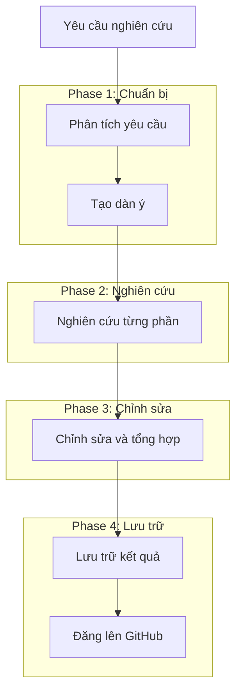
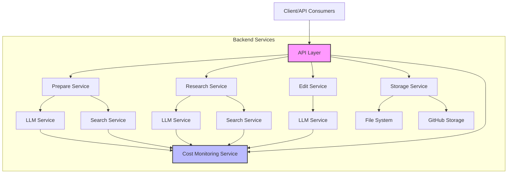

# Deep Research Agent

Một agent thông minh giúp thực hiện nghiên cứu chuyên sâu và tạo ra các bài viết phân tích chất lượng cao. Hệ thống hỗ trợ quy trình hoàn chỉnh từ phân tích yêu cầu nghiên cứu đến tạo dàn ý, nghiên cứu chi tiết, và chỉnh sửa bài viết.

Dự án này bao gồm [tài liệu API chi tiết](docs/api.md) mô tả đầy đủ các endpoints và luồng tương tác giữa các thành phần trong hệ thống.

## Tính năng chính

- Phân tích yêu cầu nghiên cứu và tự động tạo đề cương nghiên cứu chi tiết
- Tiến hành nghiên cứu chuyên sâu và tổng hợp kết quả có nguồn tham khảo
- Tạo nội dung hoàn chỉnh với định dạng chuẩn cho tài liệu cuối cùng
- Theo dõi tiến độ và chi phí sử dụng LLM/search API cho từng task
- Tối ưu hóa lưu trữ dữ liệu và giảm thiểu dư thừa
- Hỗ trợ lưu trữ kết quả trên GitHub

## Quy trình nghiên cứu hoàn chỉnh



## Kiến trúc hệ thống



## Cài đặt

1. Clone repository:
```bash
git clone https://github.com/yourusername/deep-research-agent.git
cd deep-research-agent
```

2. Cài đặt dependencies:
```bash
pip install -r requirements.txt
```

3. Cấu hình environment variables:
Tạo file `.env` với các biến môi trường sau:
```
# LLM Services
OPENAI_API_KEY=your_openai_api_key
ANTHROPIC_API_KEY=your_anthropic_api_key

# Search Services
PERPLEXITY_API_KEY=your_perplexity_api_key
GOOGLE_API_KEY=your_google_api_key
GOOGLE_CSE_ID=your_google_cse_id

# Storage Services (tùy chọn)
GITHUB_TOKEN=your_github_token
GITHUB_USERNAME=your_github_username
GITHUB_REPO=your_github_repo
```

## Sử dụng

### Chạy ứng dụng:
```bash
uvicorn app.api.main:app --host 0.0.0.0 --port 8000 --reload
```

### API Endpoints chính:

#### 1. Tạo yêu cầu nghiên cứu hoàn chỉnh:
```
POST /api/v1/research/complete
```
Body:
```json
{
  "query": "Chủ đề cần nghiên cứu"
}
```

#### 2. Kiểm tra trạng thái và kết quả:
```
GET /api/v1/research/{research_id}
GET /api/v1/research/{research_id}/status
GET /api/v1/research/{research_id}/progress
GET /api/v1/research/{research_id}/outline
GET /api/v1/research/{research_id}/cost
```

#### 3. Lấy danh sách các nghiên cứu:
```
GET /api/v1/research
```

## Tài liệu chi tiết

- [Tài liệu API đầy đủ](docs/api.md) - Chi tiết về các endpoints, request/response và sequence diagrams

## Docker

Chạy với Docker:
```bash
# Sao chép file .env.example thành .env và cấu hình
cp .env.example .env

# Xây dựng và chạy
docker compose up -d --build
```

API có sẵn tại: http://localhost:8000/api/v1

## Testing

```bash
pytest tests/ -v
```

## License

MIT License - xem [LICENSE](LICENSE) để biết thêm chi tiết.
