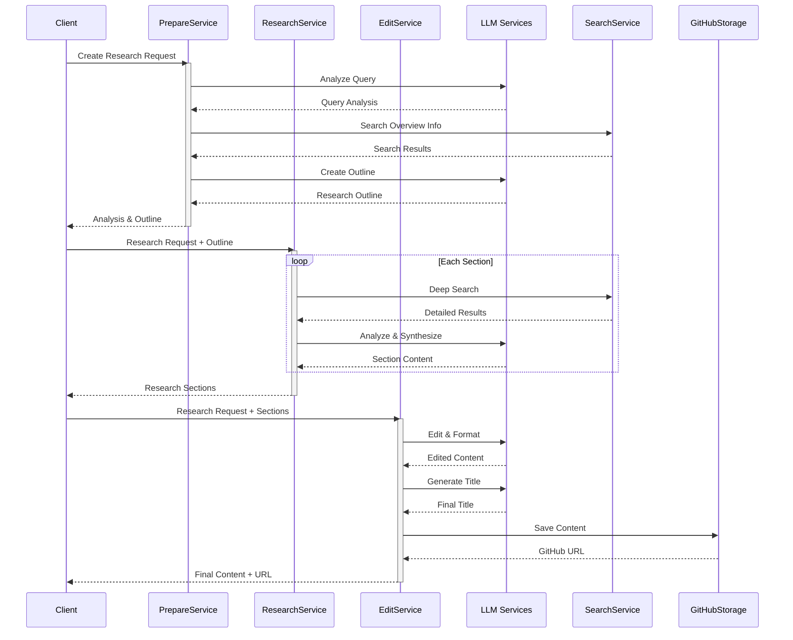

# Deep Research Agent

Một agent thông minh giúp thực hiện nghiên cứu chuyên sâu và tạo ra các bài viết phân tích chất lượng cao.

## Tính năng

- Phân tích yêu cầu nghiên cứu để xác định chủ đề, phạm vi và đối tượng đọc
- Tạo dàn ý chi tiết cho bài nghiên cứu
- Thực hiện nghiên cứu chuyên sâu cho từng phần của bài viết
- Tổng hợp và chỉnh sửa nội dung thành bài viết hoàn chỉnh
- Hỗ trợ lưu trữ và quản lý nội dung trên GitHub

## Quy trình hoạt động



## Cấu trúc dự án

```
app/
├── services/
│   ├── core/                  # Các dịch vụ cơ bản
│   │   ├── llm/              # Dịch vụ xử lý ngôn ngữ
│   │   │   ├── base.py
│   │   │   ├── openai.py     # OpenAI service
│   │   │   └── claude.py     # Claude service
│   │   ├── search/           # Dịch vụ tìm kiếm
│   │   │   ├── base.py
│   │   │   ├── google.py     # Google search
│   │   │   └── perplexity.py # Perplexity search
│   │   └── storage/          # Dịch vụ lưu trữ
│   │       ├── base.py
│   │       └── github.py     # GitHub storage
│   ├── research/             # Các dịch vụ nghiệp vụ
│   │   ├── base.py          # Base classes
│   │   ├── prepare.py       # Chuẩn bị nghiên cứu
│   │   ├── research.py      # Thực hiện nghiên cứu
│   │   └── edit.py          # Chỉnh sửa nội dung
│   └── __init__.py
```

## Cài đặt

Coming soon...

## Sử dụng

Coming soon...

## Testing

Chạy tests:
```bash
pytest tests/ -v
```

## Contributing

1. Fork repository
2. Tạo branch mới (`git checkout -b feature/your-feature`)
3. Commit thay đổi (`git commit -am 'Add new feature'`)
4. Push lên branch (`git push origin feature/your-feature`)
5. Tạo Pull Request

## License

MIT License - xem [LICENSE](LICENSE) để biết thêm chi tiết.
