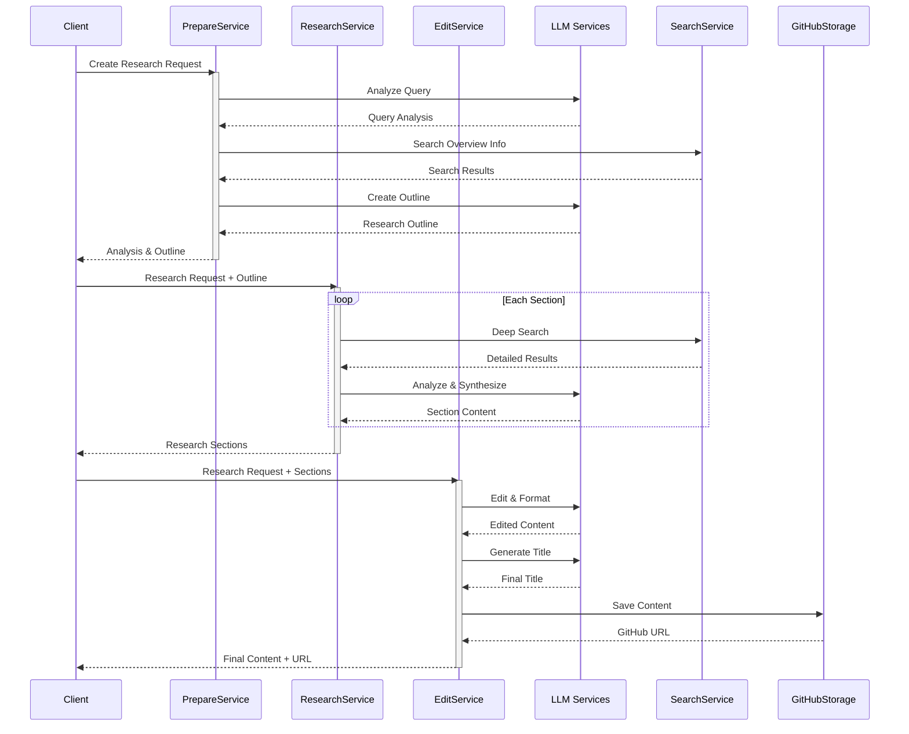

# Deep Research Agent

Một agent thông minh giúp thực hiện nghiên cứu chuyên sâu và tạo ra các bài viết phân tích chất lượng cao.

## Tính năng

- Phân tích yêu cầu nghiên cứu để xác định chủ đề, phạm vi và đối tượng đọc
- Tạo dàn ý chi tiết cho bài nghiên cứu
- Thực hiện nghiên cứu chuyên sâu cho từng phần của bài viết
- Tổng hợp và chỉnh sửa nội dung thành bài viết hoàn chỉnh
- Hỗ trợ lưu trữ và quản lý nội dung trên GitHub

## Quy trình hoạt động



## Cấu trúc dự án

```
app/
├── services/
│   ├── core/                  # Các dịch vụ cơ bản
│   │   ├── llm/              # Dịch vụ xử lý ngôn ngữ
│   │   │   ├── base.py
│   │   │   ├── openai.py     # OpenAI service
│   │   │   └── claude.py     # Claude service
│   │   ├── search/           # Dịch vụ tìm kiếm
│   │   │   ├── base.py
│   │   │   ├── google.py     # Google search
│   │   │   └── perplexity.py # Perplexity search
│   │   └── storage/          # Dịch vụ lưu trữ
│   │       ├── base.py
│   │       └── github.py     # GitHub storage
│   ├── research/             # Các dịch vụ nghiệp vụ
│   │   ├── base.py          # Base classes
│   │   ├── prepare.py       # Chuẩn bị nghiên cứu
│   │   ├── research.py      # Thực hiện nghiên cứu
│   │   └── edit.py          # Chỉnh sửa nội dung
│   └── __init__.py
```

## Cài đặt

1. Clone repository:
```bash
git clone https://github.com/yourusername/deep-research-agent.git
cd deep-research-agent
```

2. Cài đặt dependencies:
```bash
pip install -r requirements.txt
```

3. Cấu hình environment variables:
Tạo file `.env` với các biến môi trường sau:
```
# LLM Services
OPENAI_API_KEY=your_openai_api_key
ANTHROPIC_API_KEY=your_anthropic_api_key

# Search Services
PERPLEXITY_API_KEY=your_perplexity_api_key
GOOGLE_API_KEY=your_google_api_key
GOOGLE_CSE_ID=your_google_cse_id

# Storage Services
GITHUB_TOKEN=your_github_token
GITHUB_USERNAME=your_github_username
GITHUB_REPO=your_github_repo
```

## Sử dụng

### Chạy ứng dụng:
```bash
python run.py
```

### API Endpoints:

1. Tạo yêu cầu nghiên cứu mới:
```
POST /research/create
```
Body:
```json
{
  "query": "Chủ đề cần nghiên cứu",
  "language": "vi"
}
```

2. Kiểm tra trạng thái nghiên cứu:
```
GET /research/status/{task_id}
```

3. Lấy kết quả nghiên cứu:
```
GET /research/result/{task_id}
```

4. Chỉ thực hiện giai đoạn chỉnh sửa (sử dụng dữ liệu có sẵn):
```
POST /research/edit_only
```
Body:
```json
{
  "task_id": "id_của_task_đã_có"
}
```

### Ví dụ sử dụng với curl:
```bash
# Tạo yêu cầu nghiên cứu mới
curl -X POST "http://localhost:8000/research/create" \
  -H "Content-Type: application/json" \
  -d '{"query": "Sự phát triển của trí tuệ nhân tạo ở Việt Nam", "language": "vi"}'

# Kiểm tra trạng thái
curl -X GET "http://localhost:8000/research/status/your_task_id"

# Lấy kết quả
curl -X GET "http://localhost:8000/research/result/your_task_id"
```

## Testing

Chạy tests:
```bash
pytest tests/ -v
```

## Contributing

1. Fork repository
2. Tạo branch mới (`git checkout -b feature/your-feature`)
3. Commit thay đổi (`git commit -am 'Add new feature'`)
4. Push lên branch (`git push origin feature/your-feature`)
5. Tạo Pull Request

## License

MIT License - xem [LICENSE](LICENSE) để biết thêm chi tiết.
