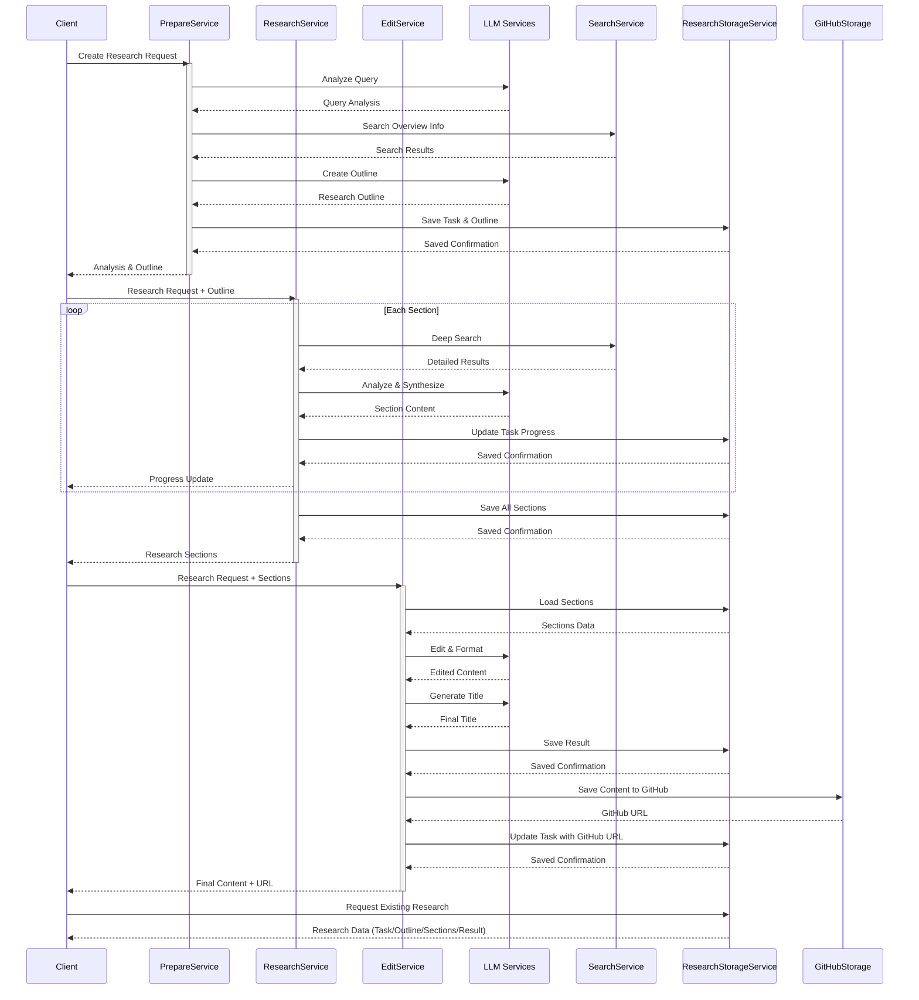

# Deep Research Agent

Một agent thông minh giúp thực hiện nghiên cứu chuyên sâu và tạo ra các bài viết phân tích chất lượng cao.

## Tính năng

- Phân tích yêu cầu nghiên cứu để xác định chủ đề, phạm vi và đối tượng đọc
- Tạo dàn ý chi tiết cho bài nghiên cứu
- Thực hiện nghiên cứu chuyên sâu cho từng phần của bài viết
- Tổng hợp và chỉnh sửa nội dung thành bài viết hoàn chỉnh
- Hỗ trợ lưu trữ và quản lý nội dung trên GitHub
- Theo dõi tiến độ chi tiết của quá trình nghiên cứu
- Tối ưu hóa lưu trữ dữ liệu và giảm thiểu dư thừa
- Phân tích thông minh ngay cả khi chỉ cung cấp câu hỏi nghiên cứu
- Cơ chế validation và retry để đảm bảo chất lượng

## Quy trình hoạt động



## Cấu trúc dự án

```
app/
├── api/                      # API endpoints
│   ├── __init__.py
│   ├── main.py              # FastAPI app
│   └── routes.py            # API routes
├── core/                     # Core functionality
│   ├── __init__.py
│   ├── config.py            # Configuration
│   ├── factory.py           # Service factory
│   └── logging.py           # Logging setup
├── models/                   # Data models
│   ├── __init__.py
│   └── research.py          # Research models
├── services/
│   ├── core/                # Các dịch vụ cơ bản
│   │   ├── llm/            # Dịch vụ xử lý ngôn ngữ
│   │   │   ├── base.py
│   │   │   ├── openai.py   # OpenAI service
│   │   │   └── claude.py   # Claude service
│   │   ├── search/         # Dịch vụ tìm kiếm
│   │   │   ├── base.py
│   │   │   ├── google.py   # Google search
│   │   │   └── perplexity.py # Perplexity search
│   │   └── storage/        # Dịch vụ lưu trữ
│   │       ├── base.py
│   │       └── github.py   # GitHub storage
│   ├── research/           # Các dịch vụ nghiệp vụ
│   │   ├── base.py        # Base classes
│   │   ├── prepare.py     # Chuẩn bị nghiên cứu
│   │   ├── research.py    # Thực hiện nghiên cứu
│   │   ├── edit.py        # Chỉnh sửa nội dung
│   │   └── storage.py     # Lưu trữ dữ liệu nghiên cứu
│   └── __init__.py
└── utils/                   # Các tiện ích
    ├── __init__.py
    └── helpers.py          # Hàm tiện ích
```

## Cấu trúc dữ liệu

```
data/
├── research_tasks/          # Thư mục chứa dữ liệu nghiên cứu
│   ├── {task_id}/          # Thư mục của mỗi task
│   │   ├── task.json       # Thông tin cơ bản của task
│   │   ├── outline.json    # Dàn ý nghiên cứu
│   │   ├── sections.json   # Nội dung các phần đã nghiên cứu
│   │   └── result.json     # Kết quả cuối cùng
└── test_output/            # Thư mục chứa kết quả test
    └── research_phase1_{task_id}.json  # Kết quả test phase 1
    └── research_phase2_{task_id}.json  # Kết quả test phase 2
```

## Mô hình dữ liệu

### ResearchRequest
Chứa thông tin về yêu cầu nghiên cứu:
- `query`: Câu hỏi hoặc chủ đề nghiên cứu
- `topic`: Chủ đề nghiên cứu (tùy chọn)
- `scope`: Phạm vi nghiên cứu (tùy chọn)
- `target_audience`: Đối tượng độc giả (tùy chọn)

### ResearchOutline
Chứa thông tin về dàn ý nghiên cứu:
- `sections`: Danh sách các phần trong bài nghiên cứu

### ResearchSection
Chứa thông tin về một phần của bài nghiên cứu:
- `title`: Tiêu đề phần
- `description`: Mô tả phần
- `content`: Nội dung chi tiết (chỉ có sau khi đã nghiên cứu)

### ResearchResult
Chứa kết quả nghiên cứu hoàn chỉnh:
- `title`: Tiêu đề bài nghiên cứu
- `content`: Nội dung bài nghiên cứu
- `sections`: Các phần của bài nghiên cứu
- `sources`: Danh sách nguồn tham khảo

### ResearchResponse
Chứa phản hồi cho yêu cầu nghiên cứu:
- `id`: ID của research task
- `status`: Trạng thái hiện tại
- `request`: Yêu cầu nghiên cứu gốc
- `outline`: Dàn ý nghiên cứu
- `sections`: Các phần đã nghiên cứu
- `result`: Kết quả nghiên cứu
- `error`: Thông tin lỗi nếu có
- `github_url`: URL của repository trên GitHub
- `progress_info`: Thông tin chi tiết về tiến độ nghiên cứu
- `created_at`: Thời điểm tạo
- `updated_at`: Thời điểm cập nhật cuối

## Cài đặt

1. Clone repository:
```bash
git clone https://github.com/yourusername/deep-research-agent.git
cd deep-research-agent
```

2. Cài đặt dependencies:
```bash
pip install -r requirements.txt
```

3. Cấu hình environment variables:
Tạo file `.env` với các biến môi trường sau:
```
# LLM Services
OPENAI_API_KEY=your_openai_api_key
ANTHROPIC_API_KEY=your_anthropic_api_key

# Search Services
PERPLEXITY_API_KEY=your_perplexity_api_key
GOOGLE_API_KEY=your_google_api_key
GOOGLE_CSE_ID=your_google_cse_id

# Storage Services
GITHUB_TOKEN=your_github_token
GITHUB_USERNAME=your_github_username
GITHUB_REPO=your_github_repo
```

## Sử dụng

### Chạy ứng dụng:
```bash
python run.py
```

### API Endpoints:

1. Tạo yêu cầu nghiên cứu mới:
```
POST /research
```
Body:
```json
{
  "query": "Chủ đề cần nghiên cứu",
  "topic": "Chủ đề chi tiết (tùy chọn)",
  "scope": "Phạm vi nghiên cứu (tùy chọn)",
  "target_audience": "Đối tượng đọc (tùy chọn)"
}
```

2. Kiểm tra trạng thái và tiến độ nghiên cứu:
```
GET /research/{research_id}/status
```

3. Theo dõi tiến trình chi tiết:
```
GET /research/{research_id}/progress
```

4. Lấy kết quả nghiên cứu:
```
GET /research/{research_id}
```

5. Chỉ thực hiện giai đoạn chỉnh sửa (sử dụng dữ liệu có sẵn):
```
POST /research/edit_only
```
Body:
```json
{
  "task_id": "id_của_task_đã_có"
}
```

### Ví dụ sử dụng với curl:
```bash
# Tạo yêu cầu nghiên cứu mới
curl -X POST "http://localhost:8000/research" \
  -H "Content-Type: application/json" \
  -d '{"query": "Sự phát triển của trí tuệ nhân tạo ở Việt Nam"}'

# Kiểm tra trạng thái
curl -X GET "http://localhost:8000/research/{task_id}/status"

# Theo dõi tiến trình chi tiết
curl -X GET "http://localhost:8000/research/{task_id}/progress"

# Lấy kết quả
curl -X GET "http://localhost:8000/research/{task_id}"
```

## Các cải tiến mới

### Theo dõi tiến độ chi tiết
- Thêm trường `progress_info` trong `ResearchResponse` để cung cấp thông tin chi tiết về tiến độ
- Theo dõi từng bước nhỏ trong quá trình nghiên cứu, bao gồm phân tích, tạo dàn ý, nghiên cứu từng phần, và chỉnh sửa
- Thông tin thời gian xử lý cho mỗi giai đoạn

### Cải thiện xử lý lỗi
- Xử lý tốt hơn các tình huống khi file không tồn tại
- Thay thế lỗi bằng cảnh báo khi phù hợp
- Cơ chế retry và validation để đảm bảo chất lượng kết quả

### Tối ưu lưu trữ dữ liệu
- Cải thiện cấu trúc lưu trữ dữ liệu để giảm thiểu dư thừa
- Tách biệt giữa thông tin cơ bản và dữ liệu chi tiết
- Hỗ trợ việc tiếp tục nghiên cứu từ các giai đoạn trước đó

### Phân tích yêu cầu thông minh
- Phân tích tự động yêu cầu nghiên cứu khi người dùng chỉ cung cấp câu hỏi
- Trích xuất chủ đề, phạm vi và đối tượng đọc từ yêu cầu
- Đảm bảo dàn ý phù hợp với yêu cầu nghiên cứu gốc

### Cơ chế validation
- Validation dữ liệu đầu vào để đảm bảo tính nhất quán
- Kiểm tra sự phù hợp của dàn ý với chủ đề nghiên cứu
- Cơ chế retry tự động khi nhận được kết quả không hợp lệ

## Luồng xử lý chính

1. **Prepare Phase**:
   - Phân tích yêu cầu nghiên cứu (`analyze_query`)
   - Tạo dàn ý chi tiết (`create_outline`)
   - Validation dàn ý đảm bảo phù hợp với yêu cầu

2. **Research Phase**:
   - Nghiên cứu từng phần của dàn ý (`research_section`)
   - Cập nhật tiến độ thông qua callback
   - Lưu trữ thông tin nghiên cứu

3. **Edit Phase**:
   - Tổng hợp nội dung từ các phần
   - Chỉnh sửa và định dạng bài viết
   - Tạo tiêu đề và trích dẫn nguồn
   - Lưu trữ kết quả cuối cùng

## Testing

Chạy tests:
```bash
pytest tests/ -v
```

Chạy test research phase 1:
```bash
python test_research_phase1.py
```

Chạy test research phase 2:
```bash
python test_research_phase2.py
```

## Contributing

1. Fork repository
2. Tạo branch mới (`git checkout -b feature/your-feature`)
3. Commit thay đổi (`git commit -am 'Add new feature'`)
4. Push lên branch (`git push origin feature/your-feature`)
5. Tạo Pull Request

## License

MIT License - xem [LICENSE](LICENSE) để biết thêm chi tiết.
