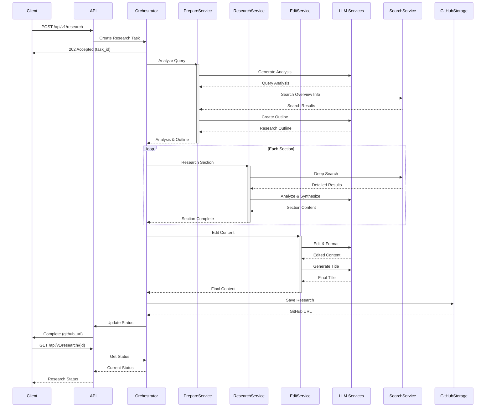

# Deep Research Agent

Một dịch vụ API tự động hóa nghiên cứu sử dụng AI (OpenAI GPT-4 và Claude) để tạo ra các bài nghiên cứu chuyên sâu.

## Tổng quan

Deep Research Agent là một hệ thống tự động hóa quy trình nghiên cứu học thuật, sử dụng sức mạnh của các Large Language Models (LLMs) và công cụ tìm kiếm thông minh. Hệ thống được thiết kế để:

1. **Phân tích yêu cầu** - Hiểu sâu về chủ đề, phạm vi và đối tượng độc giả
2. **Tạo dàn ý thông minh** - Xây dựng cấu trúc logic cho bài nghiên cứu
3. **Nghiên cứu chuyên sâu** - Thu thập và phân tích thông tin từ nhiều nguồn
4. **Biên tập chuyên nghiệp** - Tổng hợp và trình bày nội dung một cách mạch lạc
5. **Quản lý tài liệu tham khảo** - Tự động trích dẫn và tạo danh mục tài liệu

## Kiến trúc

### Sequence Diagram



### Core Components

1. **Prepare Service**
   - Query Analysis
   - Outline Creation
   - Research Planning

2. **Research Service**
   - Deep Research
   - Information Gathering
   - Source Verification

3. **Edit Service**
   - Content Editing
   - Title Creation
   - Citation Management

### Supporting Services

1. **LLM Services**
   - OpenAI GPT-4
   - Anthropic Claude

2. **Search Services**
   - Perplexity
   - Google Search

3. **Storage Service**
   - GitHub Integration

## API Endpoints

### POST /api/v1/research
Tạo một nghiên cứu mới

```json
Request:
{
    "topic": "Chủ đề nghiên cứu",
    "scope": "Phạm vi nghiên cứu",
    "target_audience": "Đối tượng độc giả"
}

Response:
{
    "id": "research_id",
    "status": "pending",
    "github_url": null,
    "created_at": "2024-03-05T10:00:00Z",
    "updated_at": "2024-03-05T10:00:00Z"
}
```

### GET /api/v1/research/{research_id}
Kiểm tra trạng thái nghiên cứu

```json
Response:
{
    "id": "research_id",
    "status": "completed",
    "github_url": "https://github.com/username/repo/blob/main/research.md",
    "created_at": "2024-03-05T10:00:00Z",
    "updated_at": "2024-03-05T10:30:00Z"
}
```

## Cài đặt

### Yêu cầu
- Python 3.11+
- Docker và Docker Compose
- API keys:
  - OpenAI API key
  - Anthropic API key
  - GitHub Access Token

### Cài đặt với Docker

1. Clone repository:
```bash
git clone https://github.com/yourusername/deep-research-agent-python.git
cd deep-research-agent-python
```

2. Tạo file .env:
```bash
cp .env.example .env
# Cập nhật các biến môi trường trong .env
```

3. Build và chạy với Docker:
```bash
docker compose up --build
```

### Cài đặt cho Development

1. Tạo virtual environment:
```bash
python -m venv venv
source venv/bin/activate  # Linux/macOS
# hoặc
.\venv\Scripts\activate  # Windows
```

2. Cài đặt dependencies:
```bash
pip install -r requirements.txt
```

3. Chạy development server:
```bash
python run.py
```

## Development

### Cấu trúc Project
```
deep-research-agent-python/
├── app/
│   ├── api/          # FastAPI routes và endpoints
│   ├── core/         # Core configuration và utilities
│   ├── models/       # Pydantic models
│   ├── services/     # Business logic services
│   └── utils/        # Helper functions
├── tests/            # Unit và integration tests
└── docs/            # Documentation
```

### Testing
```bash
# Chạy unit tests
pytest

# Chạy với coverage
pytest --cov=app tests/
```

### Code Style
```bash
# Format code
black .

# Sort imports
isort .

# Type checking
mypy .
```

## Documentation

- API Documentation: [docs/api.md](docs/api.md)
- Development Guide: [docs/development.md](docs/development.md)

## Contributing

1. Fork repository
2. Tạo feature branch
3. Commit changes
4. Push to branch
5. Tạo Pull Request

## License

MIT License
