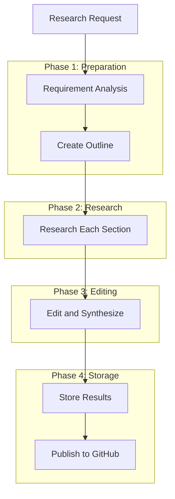
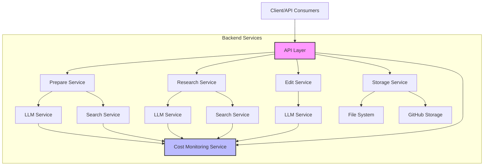

# Deep Research Agent

An intelligent agent that helps perform in-depth research and create high-quality analytical content. The system supports a complete process from analyzing research requirements to creating outlines, detailed research, and editing articles.

This project includes [detailed API documentation](docs/api.md) describing all endpoints and interaction flows between components in the system.

## Key Features

- Analyze research requirements and automatically generate detailed research outlines
- Conduct in-depth research and synthesize results with references
- Create complete content with standard formatting for the final document
- Track progress and cost of using LLM/search APIs for each task
- Optimize data storage and minimize redundancy
- Support storing results on GitHub

## Complete Research Process



## System Architecture



## Installation

1. Clone repository:
```bash
git clone https://github.com/yourusername/deep-research-agent.git
cd deep-research-agent
```

2. Install dependencies:
```bash
pip install -r requirements.txt
```

3. Configure environment variables:
Create a `.env` file with the following environment variables:
```
# LLM Services
OPENAI_API_KEY=your_openai_api_key
ANTHROPIC_API_KEY=your_anthropic_api_key

# Search Services
PERPLEXITY_API_KEY=your_perplexity_api_key
GOOGLE_API_KEY=your_google_api_key
GOOGLE_CSE_ID=your_google_cse_id

# Storage Services (optional)
GITHUB_TOKEN=your_github_token
GITHUB_USERNAME=your_github_username
GITHUB_REPO=your_github_repo
```

## Usage

### Run the application:
```bash
uvicorn app.api.main:app --host 0.0.0.0 --port 8000 --reload
```

### Main API Endpoints:

#### 1. Create a complete research request:
```
POST /api/v1/research/complete
```
Body:
```json
{
  "query": "Research topic"
}
```

#### 2. Check status and results:
```
GET /api/v1/research/{research_id}
GET /api/v1/research/{research_id}/status
GET /api/v1/research/{research_id}/progress
GET /api/v1/research/{research_id}/outline
GET /api/v1/research/{research_id}/cost
```

#### 3. Get list of researches:
```
GET /api/v1/research
```

## Detailed Documentation

- [Complete API Documentation](docs/api.md) - Details about endpoints, request/response and sequence diagrams

## Source Code Structure

### Overview
```
app/
├── api/                # API endpoints and routes
├── core/               # Core services and utilities
│   ├── config.py       # Application configuration
│   └── factory.py      # Service factory pattern
├── models/             # Pydantic models
│   ├── cost.py         # Models for cost monitoring
│   ├── research.py     # Models for research process
│   └── ...
├── services/           # Business logic
│   ├── core/           # Core services
│   │   ├── llm/        # LLM services (OpenAI, Claude)
│   │   ├── monitoring/ # Cost monitoring
│   │   ├── search/     # Search services
│   │   └── storage/    # Storage services
│   └── research/       # Research services
│       ├── prepare.py  # Preparation phase
│       ├── research.py # Research phase
│       └── edit.py     # Editing phase
└── utils/              # Utilities
```

### Main Modules

#### 1. API Layer (`app/api/`)
- `routes.py`: Defines all API endpoints
- `main.py`: Entry point of the FastAPI application

#### 2. Service Layer (`app/services/`)
- **Core Services**: Basic services like LLM, Search, Storage
  - `llm/`: Integration with LLM APIs (OpenAI, Claude)
  - `monitoring/cost.py`: Tracking and managing API usage costs
  - `search/`: Integration with Search APIs (Perplexity, Google)
  
- **Research Services**: Handle research workflow
  - `prepare.py`: Analyze requirements and create outlines
  - `research.py`: Perform detailed research
  - `edit.py`: Edit and synthesize results

#### 3. Models (`app/models/`)
- `research.py`: Models for research process
- `cost.py`: Models for cost tracking

## Docker

### Requirements
- Docker and Docker Compose installed
- Python 3.11.10 (this version is used in Dockerfile)

### Install and Run with Docker
```bash
# Copy .env.example to .env and configure
cp .env.example .env

# Build image
docker compose build

# Run container
docker compose up -d
```

### Check logs
```bash
# View container logs
docker logs deep-research-agent

# View logs and follow continuously
docker logs -f deep-research-agent

# Filter logs to find errors
docker logs deep-research-agent 2>&1 | grep -i error
```

### Test API
```bash
# Send a research request
curl -X POST http://localhost:8000/api/v1/research/complete \
  -H "Content-Type: application/json" \
  -d '{"query": "What is ChatGPT?", "max_budget": 1.0}'

# Check the status of the request (replace {research_id} with actual ID)
curl http://localhost:8000/api/v1/research/{research_id}/status
```

### Troubleshooting
- **Restart container**: If there are changes to the code, rebuild the image and restart the container:
  ```bash
  docker compose down
  docker compose build
  docker compose up -d
  ```

API available at: http://localhost:8000/api/v1

## License

MIT License - see [LICENSE](LICENSE) for details.
