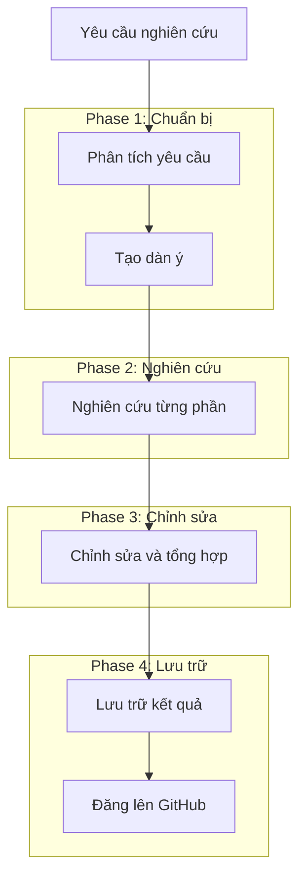
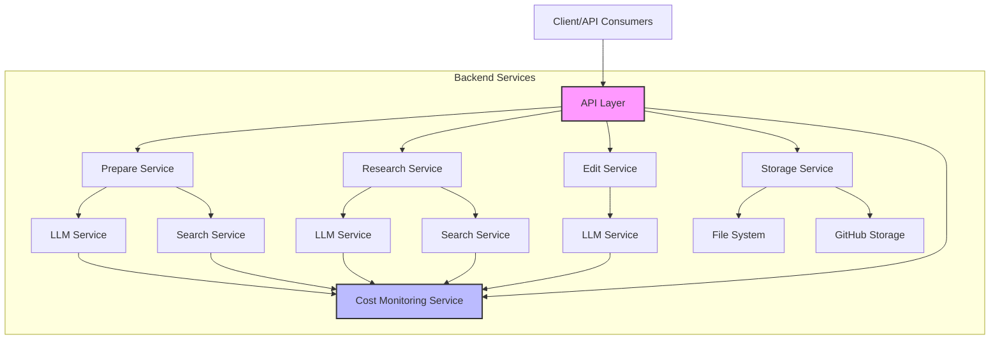

# Deep Research Agent

Một agent thông minh giúp thực hiện nghiên cứu chuyên sâu và tạo ra các bài viết phân tích chất lượng cao. Hệ thống hỗ trợ quy trình hoàn chỉnh từ phân tích yêu cầu nghiên cứu đến tạo dàn ý, nghiên cứu chi tiết, và chỉnh sửa bài viết.

Dự án này bao gồm [tài liệu API chi tiết](docs/api.md) mô tả đầy đủ các endpoints và luồng tương tác giữa các thành phần trong hệ thống.

## Tính năng chính

- Phân tích yêu cầu nghiên cứu và tự động tạo đề cương nghiên cứu chi tiết
- Tiến hành nghiên cứu chuyên sâu và tổng hợp kết quả có nguồn tham khảo
- Tạo nội dung hoàn chỉnh với định dạng chuẩn cho tài liệu cuối cùng
- Theo dõi tiến độ và chi phí sử dụng LLM/search API cho từng task
- Tối ưu hóa lưu trữ dữ liệu và giảm thiểu dư thừa
- Hỗ trợ lưu trữ kết quả trên GitHub

## Quy trình nghiên cứu hoàn chỉnh



## Kiến trúc hệ thống



## Cài đặt

1. Clone repository:
```bash
git clone https://github.com/yourusername/deep-research-agent.git
cd deep-research-agent
```

2. Cài đặt dependencies:
```bash
pip install -r requirements.txt
```

3. Cấu hình environment variables:
Tạo file `.env` với các biến môi trường sau:
```
# LLM Services
OPENAI_API_KEY=your_openai_api_key
ANTHROPIC_API_KEY=your_anthropic_api_key

# Search Services
PERPLEXITY_API_KEY=your_perplexity_api_key
GOOGLE_API_KEY=your_google_api_key
GOOGLE_CSE_ID=your_google_cse_id

# Storage Services (tùy chọn)
GITHUB_TOKEN=your_github_token
GITHUB_USERNAME=your_github_username
GITHUB_REPO=your_github_repo
```

## Sử dụng

### Chạy ứng dụng:
```bash
uvicorn app.api.main:app --host 0.0.0.0 --port 8000 --reload
```

### API Endpoints chính:

#### 1. Tạo yêu cầu nghiên cứu hoàn chỉnh:
```
POST /api/v1/research/complete
```
Body:
```json
{
  "query": "Chủ đề cần nghiên cứu"
}
```

#### 2. Kiểm tra trạng thái và kết quả:
```
GET /api/v1/research/{research_id}
GET /api/v1/research/{research_id}/status
GET /api/v1/research/{research_id}/progress
GET /api/v1/research/{research_id}/outline
GET /api/v1/research/{research_id}/cost
```

#### 3. Lấy danh sách các nghiên cứu:
```
GET /api/v1/research
```

## Tài liệu chi tiết

- [Tài liệu API đầy đủ](docs/api.md) - Chi tiết về các endpoints, request/response và sequence diagrams

## Cấu trúc Source Code

### Tổng quan
```
app/
├── api/                # API endpoints và routes
├── core/               # Core services và utilities
│   ├── config.py       # Cấu hình ứng dụng
│   └── factory.py      # Service factory pattern
├── models/             # Pydantic models
│   ├── cost.py         # Models cho cost monitoring
│   ├── research.py     # Models cho research process
│   └── ...
├── services/           # Business logic
│   ├── core/           # Core services
│   │   ├── llm/        # LLM services (OpenAI, Claude)
│   │   ├── monitoring/ # Cost monitoring
│   │   ├── search/     # Search services
│   │   └── storage/    # Storage services
│   └── research/       # Research services
│       ├── prepare.py  # Phase chuẩn bị
│       ├── research.py # Phase nghiên cứu
│       └── edit.py     # Phase chỉnh sửa
└── utils/              # Utilities
```

### Các Module Chính

#### 1. API Layer (`app/api/`)
- `routes.py`: Định nghĩa tất cả các API endpoints
- `main.py`: Entry point của ứng dụng FastAPI

#### 2. Service Layer (`app/services/`)
- **Core Services**: Các services cơ bản như LLM, Search, Storage
  - `llm/`: Tích hợp với các LLM APIs (OpenAI, Claude)
  - `monitoring/cost.py`: Theo dõi và quản lý chi phí sử dụng APIs
  - `search/`: Tích hợp với các Search APIs (Perplexity, Google)
  
- **Research Services**: Xử lý quy trình nghiên cứu
  - `prepare.py`: Phân tích yêu cầu và tạo dàn ý
  - `research.py`: Thực hiện nghiên cứu chi tiết
  - `edit.py`: Chỉnh sửa và tổng hợp kết quả

#### 3. Models (`app/models/`)
- `research.py`: Các models cho quy trình nghiên cứu
- `cost.py`: Các models cho việc theo dõi chi phí

## Docker

### Yêu cầu
- Docker và Docker Compose đã được cài đặt
- Python 3.11.10 (phiên bản này được sử dụng trong Dockerfile)

### Cài đặt và chạy với Docker
```bash
# Sao chép file .env.example thành .env và cấu hình
cp .env.example .env

# Xây dựng image
docker compose build

# Chạy container
docker compose up -d
```

### Kiểm tra logs
```bash
# Xem logs của container
docker logs deep-research-agent

# Xem logs và theo dõi liên tục
docker logs -f deep-research-agent

# Lọc logs để tìm lỗi
docker logs deep-research-agent 2>&1 | grep -i error
```

### Test API
```bash
# Gửi yêu cầu nghiên cứu
curl -X POST http://localhost:8000/api/v1/research/complete \
  -H "Content-Type: application/json" \
  -d '{"query": "Tìm hiểu về ChatGPT là gì?", "max_budget": 1.0}'

# Kiểm tra trạng thái của yêu cầu (thay {research_id} bằng ID thực tế)
curl http://localhost:8000/api/v1/research/{research_id}/status
```

### Xử lý sự cố
- **Khởi động lại container**: Nếu có thay đổi trong code, hãy build lại image và khởi động lại container:
  ```bash
  docker compose down
  docker compose build
  docker compose up -d
  ```

API có sẵn tại: http://localhost:8000/api/v1

## License

MIT License - xem [LICENSE](LICENSE) để biết thêm chi tiết.
