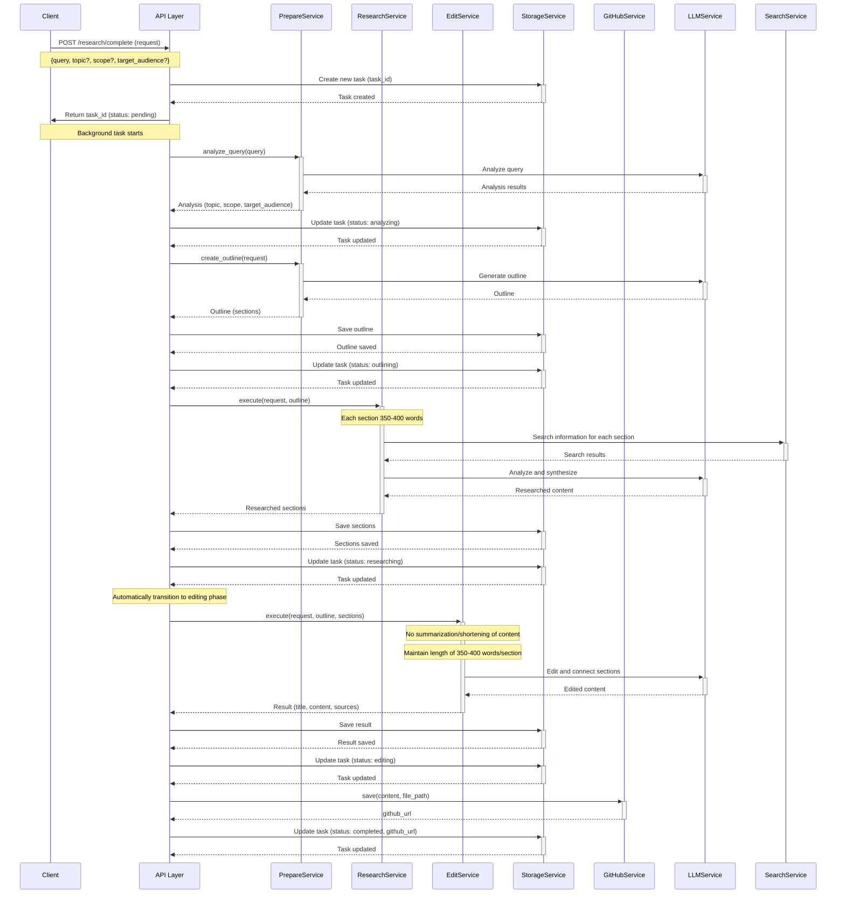
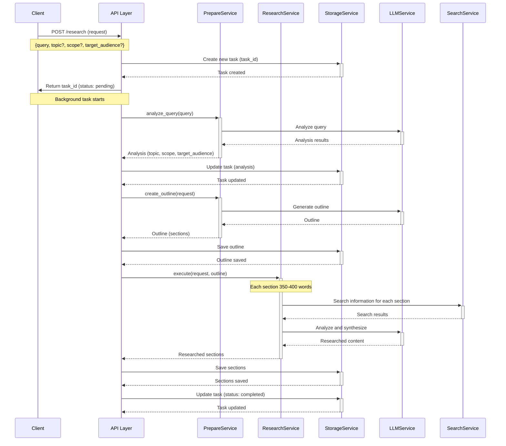
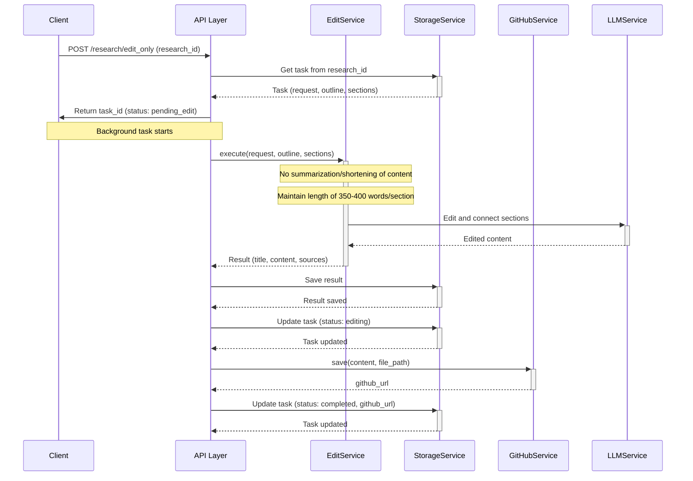

# Deep Research Agent API

API for an AI-powered automated research system. The system provides the ability to perform the entire research process automatically, including requirement analysis, outline creation, detailed research, and final editing. Each section in the research article will have a length of 350-400 words, ensuring detail and information quality.

## Base URL

```
http://localhost:8000/api/v1
```

## Endpoints

Below is a list of available endpoints:

| Method | Endpoint | Description |
|--------|----------|-------------|
| POST | `/research/complete` | Create and execute a complete research request (automatically transitions to edit) |
| POST | `/research` | Create a new research request (requires edit_only call after completion) |
| POST | `/research/edit_only` | Edit existing research content |
| GET | `/research/{research_id}` | Get information and results of research |
| GET | `/research/{research_id}/status` | Get current status of research request |
| GET | `/research/{research_id}/progress` | Get detailed progress information |
| GET | `/research/{research_id}/outline` | Get research outline |
| GET | `/research/{research_id}/cost` | Get detailed cost information of research |
| GET | `/research` | Get list of research requests |

## Sequence Diagrams

### 1. POST `/research/complete` - Create a complete research request (automatic)



This endpoint performs the entire research process from start to finish automatically. The main differences compared to the `/research` endpoint are:

1. Automatically detects when research is complete to transition to the editing phase
2. No need to call the additional `/research/edit_only` endpoint
3. All steps are performed in a single API call
4. Each section in the research article will have a length of 350-400 words
5. During editing, original content maintains its length and detail

#### Request Body

```json
{
  "query": "Research on artificial intelligence and applications in education",
  "topic": "Artificial Intelligence in Education",
  "scope": "Overview and practical applications",
  "target_audience": "Teachers and education administrators"
}
```

| Parameter | Type | Description |
|-----------|------|-------------|
| query | string | Research request (required) |
| topic | string | Research topic (optional) |
| scope | string | Research scope (optional) |
| target_audience | string | Target audience (optional) |

> **Note**: When only `query` is provided, the system will automatically analyze to determine `topic`, `scope`, and `target_audience`.

#### Response

```json
{
  "id": "ca214ee5-6204-4f3d-98c4-4f558e27399b",
  "status": "pending",
  "request": {
    "query": "Research on artificial intelligence and applications in education",
    "topic": "Artificial Intelligence in Education",
    "scope": "Overview and practical applications",
    "target_audience": "Teachers and education administrators"
  },
  "outline": null,
  "result": null,
  "error": null,
  "github_url": null,
  "progress_info": {
    "phase": "pending",
    "message": "Research request received, preparing to process",
    "timestamp": "2023-03-11T10:15:30.123456"
  },
  "created_at": "2023-03-11T10:15:30.123456",
  "updated_at": "2023-03-11T10:15:30.123456"
}
```

### 2. POST `/research` - Create a new research request



#### Request Body

```json
{
  "query": "Research on artificial intelligence and applications in education",
  "topic": "Artificial Intelligence in Education",
  "scope": "Overview and practical applications",
  "target_audience": "Teachers and education administrators"
}
```

| Parameter | Type | Description |
|-----------|------|-------------|
| query | string | Research request (required) |
| topic | string | Research topic (optional) |
| scope | string | Research scope (optional) |
| target_audience | string | Target audience (optional) |

> **Note**: When only `query` is provided, the system will automatically analyze to determine `topic`, `scope`, and `target_audience`.

#### Response

```json
{
  "id": "ca214ee5-6204-4f3d-98c4-4f558e27399b",
  "status": "pending",
  "request": {
    "query": "Research on artificial intelligence and applications in education",
    "topic": "Artificial Intelligence in Education",
    "scope": "Overview and practical applications",
    "target_audience": "Teachers and education administrators"
  },
  "outline": null,
  "result": null,
  "error": null,
  "github_url": null,
  "progress_info": {
    "phase": "pending",
    "message": "Research request received, preparing to process",
    "timestamp": "2023-03-11T10:15:30.123456"
  },
  "created_at": "2023-03-11T10:15:30.123456",
  "updated_at": "2023-03-11T10:15:30.123456"
}
```

### 3. POST `/research/edit_only` - Edit existing research content



This endpoint is used when you have completed research with the `/research` endpoint and want to continue editing and finalizing content. Key points:

1. Original content from the research phase will maintain its length and detail (no summarization)
2. Results will include title, complete content, and list of references
3. If GitHub is configured correctly, results will be saved and shared via GitHub URL

#### Request Body

```json
{
  "research_id": "ca214ee5-6204-4f3d-98c4-4f558e27399b"
}
```

| Parameter | Type | Description |
|-----------|------|-------------|
| research_id | string | ID of research request that has completed the research phase |

#### Response

```json
{
  "id": "ca214ee5-6204-4f3d-98c4-4f558e27399b",
  "status": "pending_edit",
  "request": {
    "query": "Research on artificial intelligence and applications in education",
    "topic": "Artificial Intelligence in Education",
    "scope": "Overview and practical applications",
    "target_audience": "Teachers and education administrators"
  },
  "outline": {
    "sections": [
      {
        "title": "Introduction to Artificial Intelligence in Education",
        "content": null,
        "sources": []
      },
      ...
    ]
  },
  "result": null,
  "error": null,
  "github_url": null,
  "progress_info": {
    "phase": "pending_edit",
    "message": "Edit request received, preparing to process",
    "timestamp": "2023-03-11T11:30:45.123456"
  },
  "created_at": "2023-03-11T10:15:30.123456",
  "updated_at": "2023-03-11T11:30:45.123456"
}
```

### 4. GET `/research/{research_id}` - Get information and results of research

This endpoint returns complete information about a research request, including:
- Initial information (query, topic, scope, target_audience)
- Outline (sections)
- Research content for each section
- Final result after editing (if available)
- Current status and progress information
- GitHub URL (if saved)

#### Response

```json
{
  "id": "ca214ee5-6204-4f3d-98c4-4f558e27399b",
  "status": "completed",
  "request": {
    "query": "Research on artificial intelligence and applications in education",
    "topic": "Artificial Intelligence in Education",
    "scope": "Overview and practical applications",
    "target_audience": "Teachers and education administrators"
  },
  "outline": {
    "sections": [
      {
        "title": "Introduction to Artificial Intelligence in Education",
        "content": "Detailed content for section 1...",
        "sources": [
          {
            "title": "Artificial Intelligence in Education",
            "url": "https://example.com/ai-education",
            "snippet": "AI is transforming education in multiple ways..."
          }
        ]
      },
      ...
    ]
  },
  "result": {
    "title": "Artificial Intelligence in Education: Overview and Practical Applications",
    "content": "# Artificial Intelligence in Education: Overview and Practical Applications\n\n## Introduction to Artificial Intelligence in Education\n\nDetailed content for section 1...\n\n## Section 2\n\nDetailed content for section 2...",
    "sources": [
      {
        "title": "Artificial Intelligence in Education",
        "url": "https://example.com/ai-education",
        "snippet": "AI is transforming education in multiple ways..."
      },
      ...
    ]
  },
  "error": null,
  "github_url": "https://github.com/username/repo/blob/main/researches/artificial-intelligence-in-education.md",
  "progress_info": {
    "phase": "completed",
    "message": "Research completed and stored",
    "timestamp": "2023-03-11T12:45:15.123456"
  },
  "created_at": "2023-03-11T10:15:30.123456",
  "updated_at": "2023-03-11T12:45:15.123456"
}
```

### 5. GET `/research/{research_id}/status` - Get current status of research request

This endpoint returns brief information about the current status of a research request.

#### Response

```json
{
  "id": "ca214ee5-6204-4f3d-98c4-4f558e27399b",
  "status": "researching",
  "progress_info": {
    "phase": "researching",
    "message": "Researching section 2/5: Applications of AI in Learning Assessment",
    "timestamp": "2023-03-11T11:05:20.123456"
  },
  "created_at": "2023-03-11T10:15:30.123456",
  "updated_at": "2023-03-11T11:05:20.123456"
}
```

### 6. GET `/research/{research_id}/progress` - Get detailed progress information

This endpoint returns detailed information about the progress of a research request, including:
- Overall status
- Current progress information
- History of completed steps
- Estimated completion time (if available)

#### Response

```json
{
  "id": "ca214ee5-6204-4f3d-98c4-4f558e27399b",
  "status": "researching",
  "progress_info": {
    "phase": "researching",
    "message": "Researching section 2/5: Applications of AI in Learning Assessment",
    "timestamp": "2023-03-11T11:05:20.123456"
  },
  "progress_history": [
    {
      "phase": "pending",
      "message": "Research request received, preparing to process",
      "timestamp": "2023-03-11T10:15:30.123456"
    },
    {
      "phase": "analyzing",
      "message": "Analyzing research request",
      "timestamp": "2023-03-11T10:16:00.123456"
    },
    {
      "phase": "outlining",
      "message": "Creating research outline",
      "timestamp": "2023-03-11T10:18:30.123456"
    },
    {
      "phase": "researching",
      "message": "Researching section 1/5: Introduction to Artificial Intelligence in Education",
      "timestamp": "2023-03-11T10:25:10.123456"
    },
    {
      "phase": "researching",
      "message": "Researching section 2/5: Applications of AI in Learning Assessment",
      "timestamp": "2023-03-11T11:05:20.123456"
    }
  ],
  "estimated_completion": "2023-03-11T12:30:00.000000",
  "sections_progress": [
    {
      "title": "Introduction to Artificial Intelligence in Education",
      "status": "completed",
      "timestamp": "2023-03-11T11:05:00.123456"
    },
    {
      "title": "Applications of AI in Learning Assessment",
      "status": "in_progress",
      "timestamp": "2023-03-11T11:05:20.123456"
    },
    {
      "title": "AI in Personalized Learning",
      "status": "pending",
      "timestamp": null
    },
    {
      "title": "Challenges and Limitations",
      "status": "pending",
      "timestamp": null
    },
    {
      "title": "Future of AI in Education",
      "status": "pending",
      "timestamp": null
    }
  ],
  "created_at": "2023-03-11T10:15:30.123456",
  "updated_at": "2023-03-11T11:05:20.123456"
}
```

### 7. GET `/research/{research_id}/outline` - Get research outline

This endpoint returns the outline of a research request.

#### Response

```json
{
  "id": "ca214ee5-6204-4f3d-98c4-4f558e27399b",
  "topic": "Artificial Intelligence in Education",
  "outline": {
    "sections": [
      {
        "title": "Introduction to Artificial Intelligence in Education",
        "bullets": [
          "Definition of artificial intelligence and its role in education",
          "Importance and recent developments",
          "How AI is changing traditional education models"
        ]
      },
      {
        "title": "Applications of AI in Learning Assessment",
        "bullets": [
          "Automated assessment systems",
          "Learning data analysis",
          "Predicting outcomes and learning risks"
        ]
      },
      {
        "title": "AI in Personalized Learning",
        "bullets": [
          "Adaptive learning systems",
          "Personalized learning content",
          "Virtual assistants and chatbots for learning support"
        ]
      },
      {
        "title": "Challenges and Limitations",
        "bullets": [
          "Ethical issues and privacy",
          "Technology and cost limitations",
          "Teacher training requirements"
        ]
      },
      {
        "title": "Future of AI in Education",
        "bullets": [
          "Development trends",
          "Promising research and projects",
          "Vision for an intelligent education system"
        ]
      }
    ]
  },
  "created_at": "2023-03-11T10:15:30.123456",
  "updated_at": "2023-03-11T10:18:30.123456"
}
```

### 8. GET `/research/{research_id}/cost` - Get cost information of research

This endpoint returns detailed information about API usage costs for a research request.

#### Response

```json
{
  "id": "ca214ee5-6204-4f3d-98c4-4f558e27399b",
  "total_cost": 0.325,
  "cost_breakdown": {
    "llm": {
      "total": 0.25,
      "detail": {
        "analyzing": 0.03,
        "outlining": 0.05,
        "researching": 0.12,
        "editing": 0.05
      }
    },
    "search": {
      "total": 0.075,
      "detail": {
        "researching": 0.075
      }
    }
  },
  "api_usage": [
    {
      "timestamp": "2023-03-11T10:16:00.123456",
      "service": "openai",
      "model": "gpt-4",
      "tokens": {
        "prompt": 350,
        "completion": 120
      },
      "cost": 0.03,
      "operation": "analyzing"
    },
    {
      "timestamp": "2023-03-11T10:18:30.123456",
      "service": "openai",
      "model": "gpt-4",
      "tokens": {
        "prompt": 500,
        "completion": 300
      },
      "cost": 0.05,
      "operation": "outlining"
    },
    {
      "timestamp": "2023-03-11T10:25:10.123456",
      "service": "perplexity",
      "operation": "search",
      "queries": 3,
      "cost": 0.015,
      "section": "Introduction to Artificial Intelligence in Education"
    },
    ...
  ],
  "created_at": "2023-03-11T10:15:30.123456",
  "updated_at": "2023-03-11T12:45:15.123456"
}
```

### 9. GET `/research` - Get list of research requests

This endpoint returns a list of created research requests.

#### Parameters

| Parameter | Type | Description |
|-----------|------|-------------|
| status | string | Filter by status (optional) |
| limit | integer | Maximum number of results (default: 10) |
| offset | integer | Starting position (default: 0) |

#### Response

```json
{
  "total": 25,
  "limit": 10,
  "offset": 0,
  "items": [
    {
      "id": "ca214ee5-6204-4f3d-98c4-4f558e27399b",
      "status": "completed",
      "query": "Research on artificial intelligence and applications in education",
      "topic": "Artificial Intelligence in Education",
      "created_at": "2023-03-11T10:15:30.123456",
      "updated_at": "2023-03-11T12:45:15.123456",
      "github_url": "https://github.com/username/repo/blob/main/researches/artificial-intelligence-in-education.md"
    },
    {
      "id": "8f72b391-86a2-4e0b-93b5-5d7d85319bc1",
      "status": "researching",
      "query": "Blockchain and potential in finance",
      "topic": "Blockchain in Finance",
      "created_at": "2023-03-10T14:22:10.123456",
      "updated_at": "2023-03-10T15:30:45.123456",
      "github_url": null
    },
    ...
  ]
}
```

## Status Codes

The API uses the following HTTP status codes:

| Status Code | Description |
|-------------|-------------|
| 200 | OK - Request successful |
| 201 | Created - Resource created successfully |
| 400 | Bad Request - Invalid request |
| 404 | Not Found - Resource does not exist |
| 422 | Unprocessable Entity - Invalid data submitted |
| 429 | Too Many Requests - Too many requests |
| 500 | Internal Server Error - Server error |

## Research Statuses

| Status | Description |
|--------|-------------|
| pending | Request received, preparing to process |
| analyzing | Analyzing research request |
| outlining | Creating research outline |
| researching | Performing research |
| editing | Editing content |
| completed | Research completed |
| failed | Research failed |
| pending_edit | Preparing for editing process |

## Data Models

### ResearchTask

```json
{
  "id": "string (UUID)",
  "status": "string (enum)",
  "request": {
    "query": "string",
    "topic": "string",
    "scope": "string",
    "target_audience": "string"
  },
  "outline": {
    "sections": [
      {
        "title": "string",
        "bullets": ["string"]
      }
    ]
  },
  "result": {
    "title": "string",
    "content": "string (markdown)",
    "sources": [
      {
        "title": "string",
        "url": "string",
        "snippet": "string"
      }
    ]
  },
  "error": {
    "code": "string",
    "message": "string",
    "details": "object"
  },
  "github_url": "string",
  "progress_info": {
    "phase": "string",
    "message": "string",
    "timestamp": "string (ISO datetime)"
  },
  "created_at": "string (ISO datetime)",
  "updated_at": "string (ISO datetime)"
}
```

### ResearchSection

```json
{
  "title": "string",
  "content": "string (markdown)",
  "sources": [
    {
      "title": "string",
      "url": "string",
      "snippet": "string"
    }
  ]
}
```

### Error

```json
{
  "code": "string",
  "message": "string",
  "details": "object"
}
```
