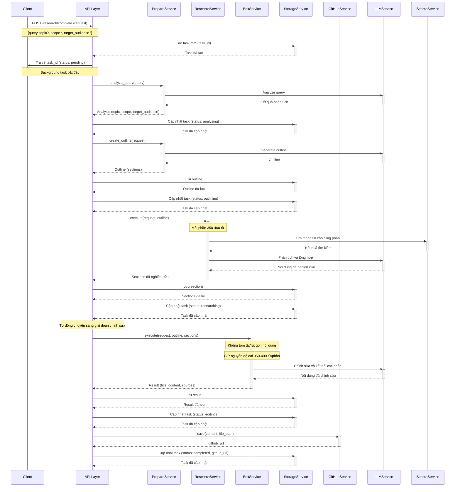
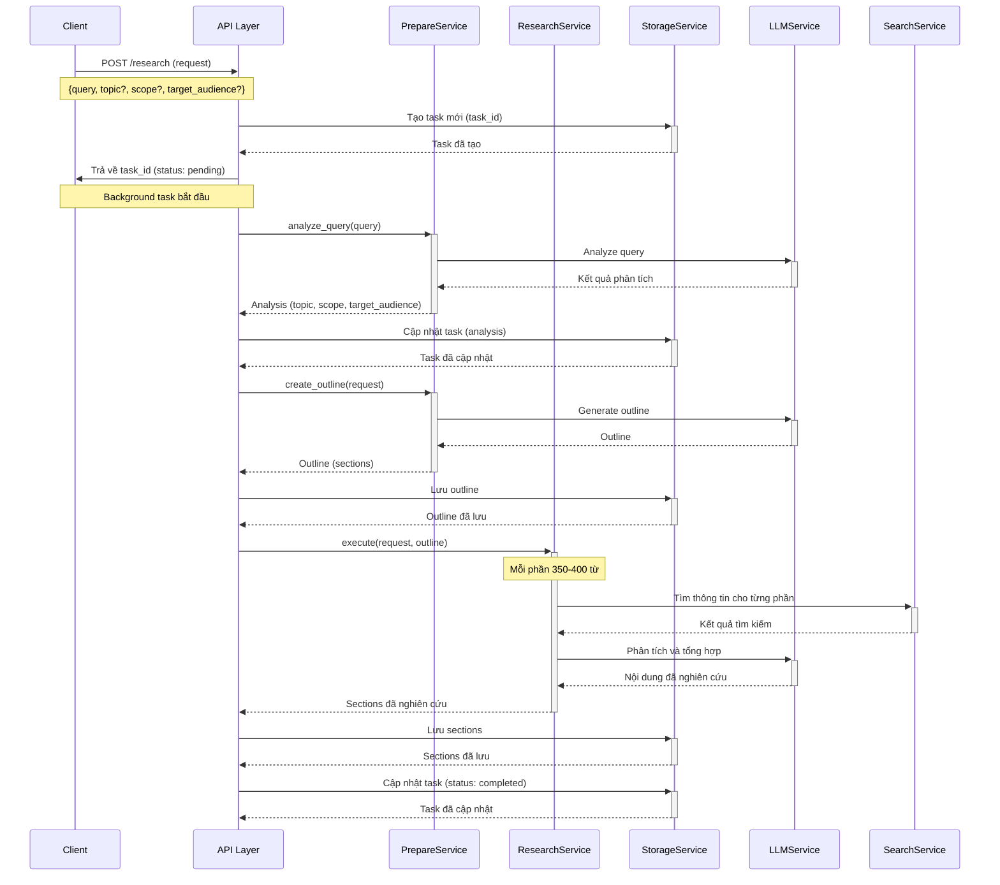
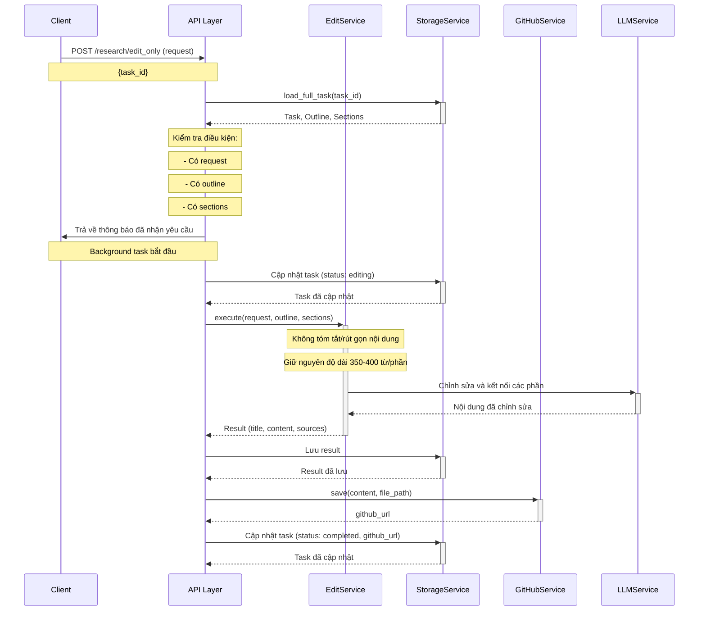
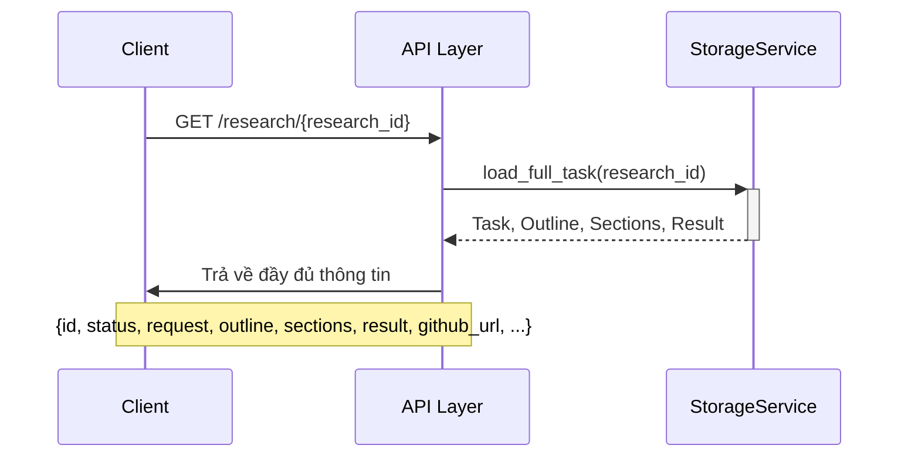
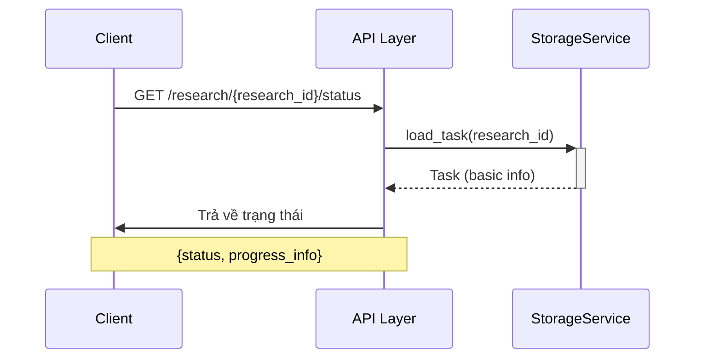
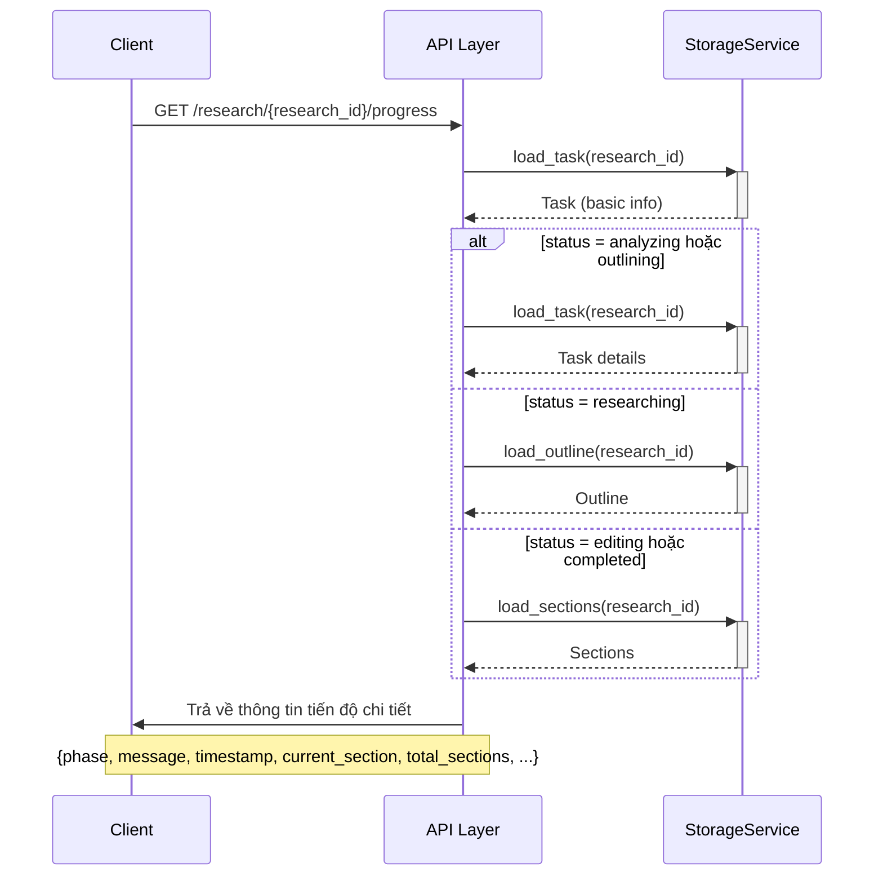
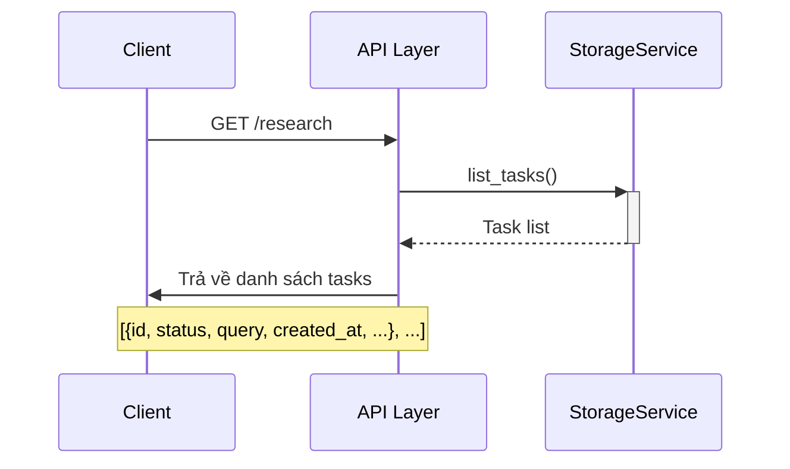

# Deep Research Agent API

API cho hệ thống nghiên cứu tự động sử dụng AI. Hệ thống cung cấp khả năng thực hiện toàn bộ quy trình nghiên cứu tự động, bao gồm phân tích yêu cầu, tạo dàn ý, nghiên cứu chi tiết, và chỉnh sửa cuối cùng. Mỗi phần trong bài nghiên cứu sẽ có độ dài từ 350-400 từ, đảm bảo độ chi tiết và chất lượng thông tin.

## Base URL

```
http://localhost:8000/api/v1
```

## Endpoints

Dưới đây là danh sách các endpoints hiện có:

| Method | Endpoint | Mô tả |
|--------|----------|-------|
| POST | `/research/complete` | Tạo và thực hiện yêu cầu nghiên cứu hoàn chỉnh (tự động chuyển sang edit) |
| POST | `/research` | Tạo yêu cầu nghiên cứu mới (cần gọi edit_only sau khi hoàn thành) |
| POST | `/research/edit_only` | Chỉnh sửa nội dung nghiên cứu sẵn có |
| GET | `/research/{research_id}` | Lấy thông tin và kết quả nghiên cứu |
| GET | `/research/{research_id}/status` | Lấy trạng thái hiện tại của yêu cầu nghiên cứu |
| GET | `/research/{research_id}/progress` | Lấy thông tin tiến độ chi tiết |
| GET | `/research/{research_id}/outline` | Lấy dàn ý nghiên cứu |
| GET | `/research/{research_id}/cost` | Lấy thông tin chi phí chi tiết của nghiên cứu |
| GET | `/research` | Lấy danh sách các yêu cầu nghiên cứu |

## Sequence Diagrams

### 1. POST `/research/complete` - Tạo yêu cầu nghiên cứu hoàn chỉnh (tự động)



Endpoint này thực hiện toàn bộ quy trình nghiên cứu từ đầu đến cuối một cách tự động. Điểm khác biệt chính so với endpoint `/research` là:

1. Tự động phát hiện khi nghiên cứu đã hoàn thành để chuyển sang giai đoạn chỉnh sửa
2. Không cần gọi thêm endpoint `/research/edit_only`
3. Tất cả các bước được thực hiện trong một lần gọi API duy nhất
4. Mỗi phần trong bài nghiên cứu sẽ có độ dài từ 350-400 từ
5. Trong quá trình chỉnh sửa, nội dung gốc sẽ được giữ nguyên độ dài và chi tiết

#### Request Body

```json
{
  "query": "Nghiên cứu về trí tuệ nhân tạo và ứng dụng trong giáo dục",
  "topic": "Trí tuệ nhân tạo trong giáo dục",
  "scope": "Tổng quan và ứng dụng thực tế",
  "target_audience": "Giáo viên và nhà quản lý giáo dục"
}
```

| Tham số | Kiểu | Mô tả |
|---------|------|-------|
| query | string | Yêu cầu nghiên cứu (bắt buộc) |
| topic | string | Chủ đề nghiên cứu (tùy chọn) |
| scope | string | Phạm vi nghiên cứu (tùy chọn) |
| target_audience | string | Đối tượng độc giả (tùy chọn) |

> **Lưu ý**: Khi chỉ cung cấp `query`, hệ thống sẽ tự động phân tích để xác định `topic`, `scope` và `target_audience`.

#### Response

```json
{
  "id": "ca214ee5-6204-4f3d-98c4-4f558e27399b",
  "status": "pending",
  "request": {
    "query": "Nghiên cứu về trí tuệ nhân tạo và ứng dụng trong giáo dục",
    "topic": "Trí tuệ nhân tạo trong giáo dục",
    "scope": "Tổng quan và ứng dụng thực tế",
    "target_audience": "Giáo viên và nhà quản lý giáo dục"
  },
  "outline": null,
  "result": null,
  "error": null,
  "github_url": null,
  "progress_info": {
    "phase": "pending",
    "message": "Đã nhận yêu cầu nghiên cứu, đang chuẩn bị xử lý",
    "timestamp": "2023-03-11T10:15:30.123456"
  },
  "created_at": "2023-03-11T10:15:30.123456",
  "updated_at": "2023-03-11T10:15:30.123456"
}
```

### 2. POST `/research` - Tạo yêu cầu nghiên cứu mới



#### Request Body

```json
{
  "query": "Nghiên cứu về trí tuệ nhân tạo và ứng dụng trong giáo dục",
  "topic": "Trí tuệ nhân tạo trong giáo dục",
  "scope": "Tổng quan và ứng dụng thực tế",
  "target_audience": "Giáo viên và nhà quản lý giáo dục"
}
```

| Tham số | Kiểu | Mô tả |
|---------|------|-------|
| query | string | Yêu cầu nghiên cứu (bắt buộc) |
| topic | string | Chủ đề nghiên cứu (tùy chọn) |
| scope | string | Phạm vi nghiên cứu (tùy chọn) |
| target_audience | string | Đối tượng độc giả (tùy chọn) |

> **Lưu ý**: Khi chỉ cung cấp `query`, hệ thống sẽ tự động phân tích để xác định `topic`, `scope` và `target_audience`.

#### Response

```json
{
  "id": "ca214ee5-6204-4f3d-98c4-4f558e27399b",
  "status": "pending",
  "request": {
    "query": "Nghiên cứu về trí tuệ nhân tạo và ứng dụng trong giáo dục",
    "topic": "Trí tuệ nhân tạo trong giáo dục",
    "scope": "Tổng quan và ứng dụng thực tế",
    "target_audience": "Giáo viên và nhà quản lý giáo dục"
  },
  "outline": null,
  "result": null,
  "error": null,
  "github_url": null,
  "progress_info": {
    "phase": "pending",
    "message": "Đã nhận yêu cầu nghiên cứu, đang chuẩn bị xử lý",
    "timestamp": "2023-03-11T10:15:30.123456"
  },
  "created_at": "2023-03-11T10:15:30.123456",
  "updated_at": "2023-03-11T10:15:30.123456"
}
```

### 3. POST `/research/edit_only` - Chỉnh sửa nội dung nghiên cứu sẵn có



### 4. GET `/research/{research_id}` - Lấy thông tin và kết quả nghiên cứu



#### Path Parameters

| Tham số | Kiểu | Mô tả |
|---------|------|-------|
| research_id | string | ID của research task |

#### Response

```json
{
  "id": "ca214ee5-6204-4f3d-98c4-4f558e27399b",
  "status": "completed",
  "request": {
    "query": "Nghiên cứu về trí tuệ nhân tạo và ứng dụng trong giáo dục",
    "topic": "Trí tuệ nhân tạo trong giáo dục",
    "scope": "Tổng quan và ứng dụng thực tế",
    "target_audience": "Giáo viên và nhà quản lý giáo dục"
  },
  "outline": {
    "sections": [
      {
        "title": "Giới thiệu về trí tuệ nhân tạo trong giáo dục",
        "description": "Tổng quan về AI và vai trò trong lĩnh vực giáo dục",
        "content": "..."
      },
      {
        "title": "Các ứng dụng hiện tại của AI trong giáo dục",
        "description": "Các ứng dụng đã và đang được triển khai",
        "content": "..."
      }
    ]
  },
  "result": {
    "title": "Trí tuệ nhân tạo trong giáo dục: Hiện tại và tương lai",
    "content": "...",
    "sections": [...],
    "sources": [
      "https://example.com/source1",
      "https://example.com/source2"
    ]
  },
  "error": null,
  "github_url": "https://github.com/username/repo/research-123",
  "progress_info": {
    "phase": "completed",
    "message": "Đã hoàn thành toàn bộ quá trình nghiên cứu",
    "timestamp": "2023-03-11T10:20:45.678901",
    "time_taken": "302.5 giây",
    "content_length": 12405,
    "sources_count": 15,
    "total_time": "305.3 giây"
  },
  "created_at": "2023-03-11T10:15:30.123456",
  "updated_at": "2023-03-11T10:20:45.678901"
}
```

### 5. GET `/research/{research_id}/status` - Lấy trạng thái nghiên cứu



#### Path Parameters

| Tham số | Kiểu | Mô tả |
|---------|------|-------|
| research_id | string | ID của research task |

#### Response

```json
{
  "status": "researching",
  "progress_info": {
    "phase": "researching",
    "message": "Đang nghiên cứu phần 2/5",
    "timestamp": "2023-03-11T10:18:30.123456",
    "current_section": 2,
    "total_sections": 5,
    "completed_sections": 1,
    "current_title": "Các ứng dụng hiện tại của AI trong giáo dục"
  }
}
```

Các trạng thái có thể:
- `pending`: Đang chờ xử lý
- `analyzing`: Đang phân tích yêu cầu
- `outlining`: Đang tạo dàn ý
- `researching`: Đang nghiên cứu
- `editing`: Đang chỉnh sửa
- `completed`: Đã hoàn thành
- `failed`: Thất bại

### 6. GET `/research/{research_id}/progress` - Lấy thông tin tiến độ chi tiết



### 7. GET `/research` - Lấy danh sách các yêu cầu nghiên cứu



## Mô hình dữ liệu

### ResearchRequest
Yêu cầu nghiên cứu
```json
{
  "query": "Nghiên cứu về trí tuệ nhân tạo và ứng dụng trong giáo dục",
  "topic": "Trí tuệ nhân tạo trong giáo dục",
  "scope": "Tổng quan và ứng dụng thực tế",
  "target_audience": "Giáo viên và nhà quản lý giáo dục"
}
```

### ResearchSection
Một phần của bài nghiên cứu
```json
{
  "title": "Giới thiệu về trí tuệ nhân tạo trong giáo dục",
  "description": "Tổng quan về AI và vai trò trong lĩnh vực giáo dục",
  "content": "Nội dung chi tiết về phần này..."
}
```

### ResearchOutline
Dàn ý nghiên cứu
```json
{
  "sections": [
    {
      "title": "Giới thiệu về trí tuệ nhân tạo trong giáo dục",
      "description": "Tổng quan về AI và vai trò trong lĩnh vực giáo dục"
    },
    {
      "title": "Các ứng dụng hiện tại của AI trong giáo dục",
      "description": "Các ứng dụng đã và đang được triển khai"
    }
  ]
}
```

### ResearchResult
Kết quả nghiên cứu hoàn chỉnh
```json
{
  "title": "Trí tuệ nhân tạo trong giáo dục: Hiện tại và tương lai",
  "content": "Nội dung đầy đủ của bài nghiên cứu...",
  "sections": [
    {
      "title": "Giới thiệu về trí tuệ nhân tạo trong giáo dục",
      "description": "Tổng quan về AI và vai trò trong lĩnh vực giáo dục",
      "content": "Nội dung chi tiết về phần này..."
    }
  ],
  "sources": [
    "https://example.com/source1",
    "https://example.com/source2"
  ]
}
```

## Quy trình nghiên cứu cải tiến

> **Flow diagram**: [Xem biểu đồ tổng quan](./sequence_diagrams.md#tóm-tắt-quy-trình-nghiên-cứu-hoàn-chỉnh)

1. **Phân tích yêu cầu**: Khi nhận được yêu cầu nghiên cứu, hệ thống sẽ tự động phân tích để xác định `topic`, `scope` và `target_audience` nếu chưa được cung cấp.

2. **Tạo dàn ý**: Hệ thống tạo dàn ý chi tiết cho nghiên cứu, dựa trên kết quả phân tích.

3. **Nghiên cứu từng phần**: Hệ thống thực hiện nghiên cứu từng phần một cách tuần tự, cập nhật tiến độ theo thời gian thực.

4. **Cập nhật tiến độ**: Trong suốt quá trình, hệ thống liên tục cập nhật thông tin tiến độ chi tiết, bao gồm giai đoạn hiện tại, số phần đã hoàn thành, và thời gian xử lý.

5. **Tự động chuyển phase**: Với endpoint `/research/complete`, hệ thống tự động phát hiện khi nghiên cứu đã hoàn thành và chuyển sang giai đoạn chỉnh sửa mà không cần can thiệp thủ công.

6. **Chỉnh sửa và tổng hợp**: Sau khi nghiên cứu xong tất cả các phần, hệ thống sẽ tổng hợp và chỉnh sửa nội dung thành một bài viết hoàn chỉnh.

7. **Lưu trữ và xuất kết quả**: Kết quả cuối cùng sẽ được lưu trữ dưới dạng JSON và Markdown, đồng thời được đăng lên GitHub nếu được cấu hình.

## Cơ chế Validation và Retry

Hệ thống áp dụng nhiều cơ chế validation để đảm bảo chất lượng kết quả:

### Validation trong Phân tích Yêu cầu
- Kiểm tra kết quả phân tích có chứa đầy đủ thông tin về topic, scope và target_audience
- Đảm bảo topic phù hợp với query
- Retry tự động nếu thiếu thông tin hoặc thông tin không liên quan

### Validation trong Tạo Dàn ý
- Kiểm tra dàn ý có ít nhất 3 phần
- Đảm bảo các phần trong dàn ý có liên quan đến topic
- Sử dụng keyword matching để đảm bảo dàn ý phù hợp với chủ đề
- Retry tự động cho đến khi có dàn ý hợp lệ

### Validation trong Nghiên cứu
- Kiểm tra nội dung có đáp ứng đủ độ dài tối thiểu
- Xác minh nội dung có liên quan đến tiêu đề phần
- Đảm bảo có nguồn tham khảo đáng tin cậy

## Xử lý lỗi

Nếu có lỗi xảy ra trong quá trình nghiên cứu, trạng thái sẽ chuyển thành `failed` và thông tin lỗi sẽ được trả về trong trường `error`:

```json
{
  "id": "ca214ee5-6204-4f3d-98c4-4f558e27399b",
  "status": "failed",
  "request": {...},
  "outline": null,
  "result": null,
  "error": {
    "message": "Lỗi trong quá trình chuẩn bị",
    "details": {
      "error": "Lỗi khi phân tích yêu cầu nghiên cứu"
    }
  },
  "github_url": null,
  "progress_info": {
    "phase": "failed",
    "message": "Đã xảy ra lỗi trong quá trình phân tích yêu cầu",
    "timestamp": "2023-03-11T10:16:45.678901",
    "error_details": "Lỗi khi phân tích yêu cầu nghiên cứu"
  },
  "created_at": "2023-03-11T10:15:30.123456",
  "updated_at": "2023-03-11T10:16:45.678901"
}
```

## Cấu trúc lưu trữ dữ liệu

Hệ thống sử dụng cấu trúc lưu trữ tối ưu để giảm thiểu dư thừa và tăng hiệu suất:

### Cấu trúc thư mục
```
data/
└── research_tasks/
    └── {task_id}/
        ├── task.json       # Thông tin cơ bản
        ├── outline.json    # Dàn ý nghiên cứu
        ├── sections.json   # Nội dung các phần
        └── result.json     # Kết quả cuối cùng
```

### Mô tả file
- **task.json**: Chứa thông tin cơ bản về task (ID, trạng thái, request, URL GitHub, tiến độ, thời gian)
- **outline.json**: Chứa danh sách các phần trong dàn ý (tiêu đề, mô tả)
- **sections.json**: Chứa nội dung chi tiết của từng phần sau khi nghiên cứu
- **result.json**: Chứa kết quả cuối cùng sau khi tổng hợp và chỉnh sửa

Cấu trúc này cho phép tách biệt các thành phần và tải theo nhu cầu, đồng thời hỗ trợ việc tiếp tục từ các giai đoạn trước đó:
- `load_task()`: Tải thông tin cơ bản
- `load_outline()`: Tải dàn ý
- `load_sections()`: Tải nội dung các phần
- `load_result()`: Tải kết quả cuối cùng
- `load_full_task()`: Tải tất cả thông tin

## Ví dụ sử dụng (Python)

### Sử dụng flow hoàn chỉnh

```python
import requests
import time

BASE_URL = "http://localhost:8000/api/v1"

# Tạo yêu cầu nghiên cứu hoàn chỉnh
data = {
    "query": "Tác động của biến đổi khí hậu đến nông nghiệp Việt Nam"
}
response = requests.post(f"{BASE_URL}/research/complete", json=data)
research_id = response.json()["id"]

# Theo dõi tiến độ
while True:
    status_response = requests.get(f"{BASE_URL}/research/{research_id}/status")
    status_data = status_response.json()
    status = status_data["status"]
    progress = status_data["progress_info"]
    
    print(f"Status: {status}")
    print(f"Progress: {progress['message']}")
    
    if status == "completed":
        # Lấy kết quả
        result_response = requests.get(f"{BASE_URL}/research/{research_id}")
        result = result_response.json()
        print("Research completed!")
        print(f"Title: {result['result']['title']}")
        print(f"Content length: {len(result['result']['content'])}")
        print(f"Sources: {len(result['result']['sources'])}")
        print(f"GitHub URL: {result['github_url']}")
        break
    elif status == "failed":
        # Xử lý lỗi
        error_response = requests.get(f"{BASE_URL}/research/{research_id}")
        error = error_response.json()["error"]
        print(f"Research failed: {error['message']}")
        break
    
    # Đợi 10 giây trước khi kiểm tra lại
    time.sleep(10)
```
