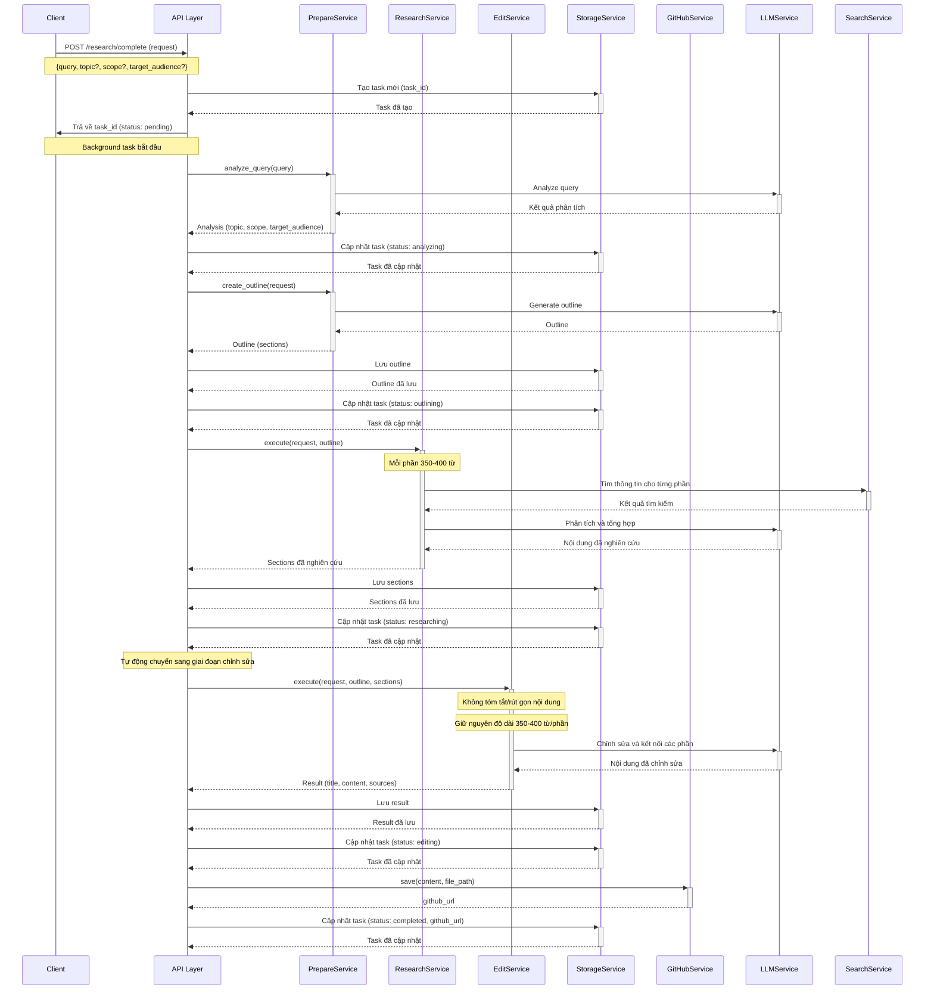
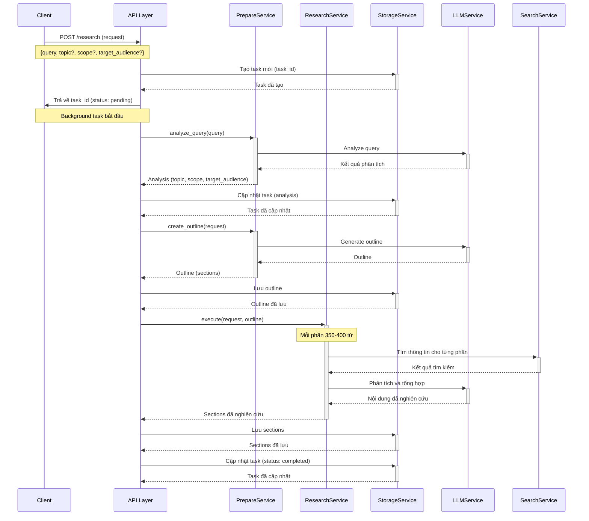
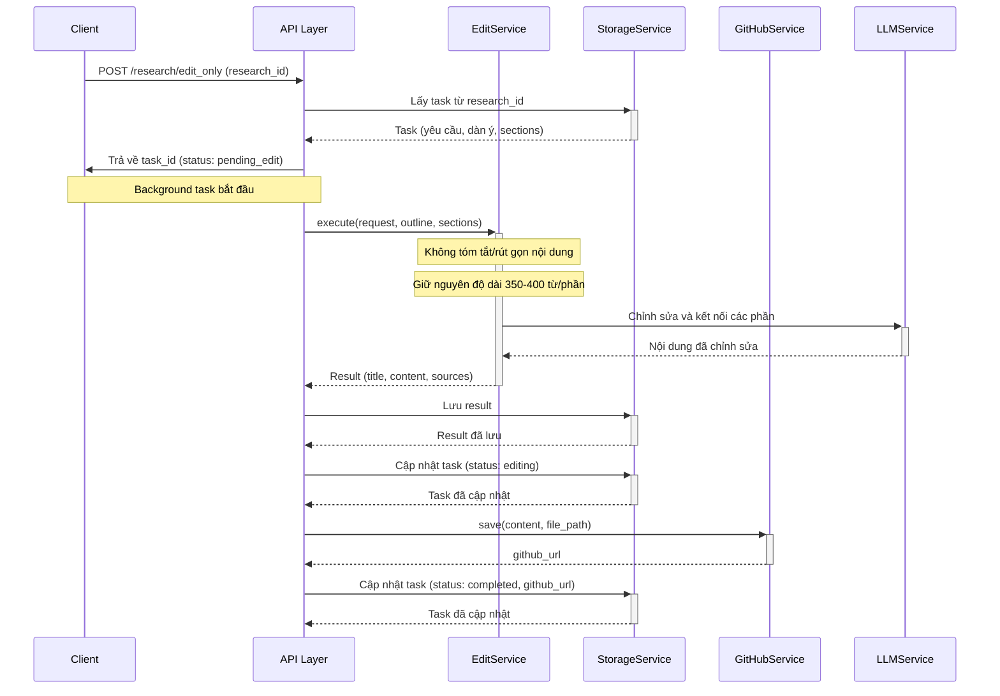

# Deep Research Agent API

API cho hệ thống nghiên cứu tự động sử dụng AI. Hệ thống cung cấp khả năng thực hiện toàn bộ quy trình nghiên cứu tự động, bao gồm phân tích yêu cầu, tạo dàn ý, nghiên cứu chi tiết, và chỉnh sửa cuối cùng. Mỗi phần trong bài nghiên cứu sẽ có độ dài từ 350-400 từ, đảm bảo độ chi tiết và chất lượng thông tin.

## Base URL

```
http://localhost:8000/api/v1
```

## Endpoints

Dưới đây là danh sách các endpoints hiện có:

| Method | Endpoint | Mô tả |
|--------|----------|-------|
| POST | `/research/complete` | Tạo và thực hiện yêu cầu nghiên cứu hoàn chỉnh (tự động chuyển sang edit) |
| POST | `/research` | Tạo yêu cầu nghiên cứu mới (cần gọi edit_only sau khi hoàn thành) |
| POST | `/research/edit_only` | Chỉnh sửa nội dung nghiên cứu sẵn có |
| GET | `/research/{research_id}` | Lấy thông tin và kết quả nghiên cứu |
| GET | `/research/{research_id}/status` | Lấy trạng thái hiện tại của yêu cầu nghiên cứu |
| GET | `/research/{research_id}/progress` | Lấy thông tin tiến độ chi tiết |
| GET | `/research/{research_id}/outline` | Lấy dàn ý nghiên cứu |
| GET | `/research/{research_id}/cost` | Lấy thông tin chi phí chi tiết của nghiên cứu |
| GET | `/research` | Lấy danh sách các yêu cầu nghiên cứu |

## Sequence Diagrams

### 1. POST `/research/complete` - Tạo yêu cầu nghiên cứu hoàn chỉnh (tự động)



Endpoint này thực hiện toàn bộ quy trình nghiên cứu từ đầu đến cuối một cách tự động. Điểm khác biệt chính so với endpoint `/research` là:

1. Tự động phát hiện khi nghiên cứu đã hoàn thành để chuyển sang giai đoạn chỉnh sửa
2. Không cần gọi thêm endpoint `/research/edit_only`
3. Tất cả các bước được thực hiện trong một lần gọi API duy nhất
4. Mỗi phần trong bài nghiên cứu sẽ có độ dài từ 350-400 từ
5. Trong quá trình chỉnh sửa, nội dung gốc sẽ được giữ nguyên độ dài và chi tiết

#### Request Body

```json
{
  "query": "Nghiên cứu về trí tuệ nhân tạo và ứng dụng trong giáo dục",
  "topic": "Trí tuệ nhân tạo trong giáo dục",
  "scope": "Tổng quan và ứng dụng thực tế",
  "target_audience": "Giáo viên và nhà quản lý giáo dục"
}
```

| Tham số | Kiểu | Mô tả |
|---------|------|-------|
| query | string | Yêu cầu nghiên cứu (bắt buộc) |
| topic | string | Chủ đề nghiên cứu (tùy chọn) |
| scope | string | Phạm vi nghiên cứu (tùy chọn) |
| target_audience | string | Đối tượng độc giả (tùy chọn) |

> **Lưu ý**: Khi chỉ cung cấp `query`, hệ thống sẽ tự động phân tích để xác định `topic`, `scope` và `target_audience`.

#### Response

```json
{
  "id": "ca214ee5-6204-4f3d-98c4-4f558e27399b",
  "status": "pending",
  "request": {
    "query": "Nghiên cứu về trí tuệ nhân tạo và ứng dụng trong giáo dục",
    "topic": "Trí tuệ nhân tạo trong giáo dục",
    "scope": "Tổng quan và ứng dụng thực tế",
    "target_audience": "Giáo viên và nhà quản lý giáo dục"
  },
  "outline": null,
  "result": null,
  "error": null,
  "github_url": null,
  "progress_info": {
    "phase": "pending",
    "message": "Đã nhận yêu cầu nghiên cứu, đang chuẩn bị xử lý",
    "timestamp": "2023-03-11T10:15:30.123456"
  },
  "created_at": "2023-03-11T10:15:30.123456",
  "updated_at": "2023-03-11T10:15:30.123456"
}
```

### 2. POST `/research` - Tạo yêu cầu nghiên cứu mới



#### Request Body

```json
{
  "query": "Nghiên cứu về trí tuệ nhân tạo và ứng dụng trong giáo dục",
  "topic": "Trí tuệ nhân tạo trong giáo dục",
  "scope": "Tổng quan và ứng dụng thực tế",
  "target_audience": "Giáo viên và nhà quản lý giáo dục"
}
```

| Tham số | Kiểu | Mô tả |
|---------|------|-------|
| query | string | Yêu cầu nghiên cứu (bắt buộc) |
| topic | string | Chủ đề nghiên cứu (tùy chọn) |
| scope | string | Phạm vi nghiên cứu (tùy chọn) |
| target_audience | string | Đối tượng độc giả (tùy chọn) |

> **Lưu ý**: Khi chỉ cung cấp `query`, hệ thống sẽ tự động phân tích để xác định `topic`, `scope` và `target_audience`.

#### Response

```json
{
  "id": "ca214ee5-6204-4f3d-98c4-4f558e27399b",
  "status": "pending",
  "request": {
    "query": "Nghiên cứu về trí tuệ nhân tạo và ứng dụng trong giáo dục",
    "topic": "Trí tuệ nhân tạo trong giáo dục",
    "scope": "Tổng quan và ứng dụng thực tế",
    "target_audience": "Giáo viên và nhà quản lý giáo dục"
  },
  "outline": null,
  "result": null,
  "error": null,
  "github_url": null,
  "progress_info": {
    "phase": "pending",
    "message": "Đã nhận yêu cầu nghiên cứu, đang chuẩn bị xử lý",
    "timestamp": "2023-03-11T10:15:30.123456"
  },
  "created_at": "2023-03-11T10:15:30.123456",
  "updated_at": "2023-03-11T10:15:30.123456"
}
```

### 3. POST `/research/edit_only` - Chỉnh sửa nội dung nghiên cứu sẵn có



Endpoint này được sử dụng khi bạn đã thực hiện nghiên cứu với endpoint `/research` và muốn tiếp tục chỉnh sửa và hoàn thiện nội dung. Điểm quan trọng:

1. Nội dung gốc từ giai đoạn nghiên cứu sẽ được giữ nguyên độ dài và chi tiết (không tóm tắt)
2. Kết quả sẽ bao gồm tiêu đề, nội dung hoàn chỉnh, và danh sách nguồn tham khảo
3. Nếu cấu hình GitHub đúng, kết quả sẽ được lưu và chia sẻ qua GitHub URL

#### Request Body

```json
{
  "research_id": "ca214ee5-6204-4f3d-98c4-4f558e27399b"
}
```

| Tham số | Kiểu | Mô tả |
|---------|------|-------|
| research_id | string | ID của yêu cầu nghiên cứu đã hoàn thành giai đoạn nghiên cứu |

#### Response

```json
{
  "id": "ca214ee5-6204-4f3d-98c4-4f558e27399b",
  "status": "pending_edit",
  "request": {
    "query": "Nghiên cứu về trí tuệ nhân tạo và ứng dụng trong giáo dục",
    "topic": "Trí tuệ nhân tạo trong giáo dục",
    "scope": "Tổng quan và ứng dụng thực tế",
    "target_audience": "Giáo viên và nhà quản lý giáo dục"
  },
  "outline": {
    "sections": [
      {
        "title": "Giới thiệu về trí tuệ nhân tạo trong giáo dục",
        "content": null,
        "sources": []
      },
      ...
    ]
  },
  "result": null,
  "error": null,
  "github_url": null,
  "progress_info": {
    "phase": "pending_edit",
    "message": "Đã nhận yêu cầu chỉnh sửa, đang chuẩn bị xử lý",
    "timestamp": "2023-03-11T11:30:45.123456"
  },
  "created_at": "2023-03-11T10:15:30.123456",
  "updated_at": "2023-03-11T11:30:45.123456"
}
```

### 4. GET `/research/{research_id}` - Lấy thông tin và kết quả nghiên cứu

Endpoint này trả về thông tin đầy đủ về một yêu cầu nghiên cứu, bao gồm:
- Thông tin ban đầu (query, topic, scope, target_audience)
- Dàn ý (sections)
- Nội dung nghiên cứu cho từng phần
- Kết quả cuối cùng sau khi chỉnh sửa (nếu có)
- Trạng thái hiện tại và thông tin tiến độ
- URL GitHub (nếu đã lưu)

#### Response

```json
{
  "id": "ca214ee5-6204-4f3d-98c4-4f558e27399b",
  "status": "completed",
  "request": {
    "query": "Nghiên cứu về trí tuệ nhân tạo và ứng dụng trong giáo dục",
    "topic": "Trí tuệ nhân tạo trong giáo dục",
    "scope": "Tổng quan và ứng dụng thực tế",
    "target_audience": "Giáo viên và nhà quản lý giáo dục"
  },
  "outline": {
    "sections": [
      {
        "title": "Giới thiệu về trí tuệ nhân tạo trong giáo dục",
        "content": "Nội dung chi tiết phần 1...",
        "sources": [
          {
            "title": "Artificial Intelligence in Education",
            "url": "https://example.com/ai-education",
            "snippet": "AI is transforming education in multiple ways..."
          }
        ]
      },
      ...
    ]
  },
  "result": {
    "title": "Trí tuệ nhân tạo trong giáo dục: Tổng quan và ứng dụng thực tế",
    "content": "# Trí tuệ nhân tạo trong giáo dục: Tổng quan và ứng dụng thực tế\n\n## Giới thiệu về trí tuệ nhân tạo trong giáo dục\n\nNội dung chi tiết phần 1...\n\n## Phần 2\n\nNội dung chi tiết phần 2...",
    "sources": [
      {
        "title": "Artificial Intelligence in Education",
        "url": "https://example.com/ai-education",
        "snippet": "AI is transforming education in multiple ways..."
      },
      ...
    ]
  },
  "error": null,
  "github_url": "https://github.com/username/repo/blob/main/researches/tri-tue-nhan-tao-trong-giao-duc.md",
  "progress_info": {
    "phase": "completed",
    "message": "Nghiên cứu đã hoàn thành và lưu trữ",
    "timestamp": "2023-03-11T12:45:15.123456"
  },
  "created_at": "2023-03-11T10:15:30.123456",
  "updated_at": "2023-03-11T12:45:15.123456"
}
```

### 5. GET `/research/{research_id}/status` - Lấy trạng thái hiện tại của yêu cầu nghiên cứu

Endpoint này trả về thông tin ngắn gọn về trạng thái hiện tại của yêu cầu nghiên cứu.

#### Response

```json
{
  "id": "ca214ee5-6204-4f3d-98c4-4f558e27399b",
  "status": "researching",
  "progress_info": {
    "phase": "researching",
    "message": "Đang nghiên cứu phần 2/5: Ứng dụng của AI trong đánh giá học tập",
    "timestamp": "2023-03-11T11:05:20.123456"
  },
  "created_at": "2023-03-11T10:15:30.123456",
  "updated_at": "2023-03-11T11:05:20.123456"
}
```

### 6. GET `/research/{research_id}/progress` - Lấy thông tin tiến độ chi tiết

Endpoint này trả về thông tin chi tiết về tiến độ của yêu cầu nghiên cứu, bao gồm:
- Trạng thái tổng thể
- Thông tin tiến độ hiện tại
- Lịch sử các bước đã thực hiện
- Thời gian ước tính hoàn thành (nếu có)

#### Response

```json
{
  "id": "ca214ee5-6204-4f3d-98c4-4f558e27399b",
  "status": "researching",
  "progress_info": {
    "phase": "researching",
    "message": "Đang nghiên cứu phần 2/5: Ứng dụng của AI trong đánh giá học tập",
    "timestamp": "2023-03-11T11:05:20.123456"
  },
  "progress_history": [
    {
      "phase": "pending",
      "message": "Đã nhận yêu cầu nghiên cứu, đang chuẩn bị xử lý",
      "timestamp": "2023-03-11T10:15:30.123456"
    },
    {
      "phase": "analyzing",
      "message": "Đang phân tích yêu cầu nghiên cứu",
      "timestamp": "2023-03-11T10:16:00.123456"
    },
    {
      "phase": "outlining",
      "message": "Đang tạo dàn ý nghiên cứu",
      "timestamp": "2023-03-11T10:18:30.123456"
    },
    {
      "phase": "researching",
      "message": "Đang nghiên cứu phần 1/5: Giới thiệu về trí tuệ nhân tạo trong giáo dục",
      "timestamp": "2023-03-11T10:25:10.123456"
    },
    {
      "phase": "researching",
      "message": "Đang nghiên cứu phần 2/5: Ứng dụng của AI trong đánh giá học tập",
      "timestamp": "2023-03-11T11:05:20.123456"
    }
  ],
  "estimated_completion": "2023-03-11T12:30:00.000000",
  "sections_progress": [
    {
      "title": "Giới thiệu về trí tuệ nhân tạo trong giáo dục",
      "status": "completed",
      "timestamp": "2023-03-11T11:05:00.123456"
    },
    {
      "title": "Ứng dụng của AI trong đánh giá học tập",
      "status": "in_progress",
      "timestamp": "2023-03-11T11:05:20.123456"
    },
    {
      "title": "AI trong cá nhân hóa học tập",
      "status": "pending",
      "timestamp": null
    },
    {
      "title": "Thách thức và hạn chế",
      "status": "pending",
      "timestamp": null
    },
    {
      "title": "Tương lai của AI trong giáo dục",
      "status": "pending",
      "timestamp": null
    }
  ],
  "created_at": "2023-03-11T10:15:30.123456",
  "updated_at": "2023-03-11T11:05:20.123456"
}
```

### 7. GET `/research/{research_id}/outline` - Lấy dàn ý nghiên cứu

Endpoint này trả về dàn ý nghiên cứu của một yêu cầu.

#### Response

```json
{
  "id": "ca214ee5-6204-4f3d-98c4-4f558e27399b",
  "topic": "Trí tuệ nhân tạo trong giáo dục",
  "outline": {
    "sections": [
      {
        "title": "Giới thiệu về trí tuệ nhân tạo trong giáo dục",
        "bullets": [
          "Định nghĩa trí tuệ nhân tạo và vai trò trong giáo dục",
          "Tầm quan trọng và sự phát triển gần đây",
          "Cách AI đang thay đổi mô hình giáo dục truyền thống"
        ]
      },
      {
        "title": "Ứng dụng của AI trong đánh giá học tập",
        "bullets": [
          "Hệ thống đánh giá tự động",
          "Phân tích dữ liệu học tập",
          "Dự đoán kết quả và rủi ro học tập"
        ]
      },
      {
        "title": "AI trong cá nhân hóa học tập",
        "bullets": [
          "Hệ thống học tập thích ứng",
          "Nội dung học tập được cá nhân hóa",
          "Trợ lý ảo và chatbot hỗ trợ học tập"
        ]
      },
      {
        "title": "Thách thức và hạn chế",
        "bullets": [
          "Vấn đề đạo đức và quyền riêng tư",
          "Hạn chế về công nghệ và chi phí",
          "Yêu cầu đào tạo giáo viên"
        ]
      },
      {
        "title": "Tương lai của AI trong giáo dục",
        "bullets": [
          "Xu hướng phát triển",
          "Các nghiên cứu và dự án triển vọng",
          "Tầm nhìn về một hệ thống giáo dục thông minh"
        ]
      }
    ]
  },
  "created_at": "2023-03-11T10:15:30.123456",
  "updated_at": "2023-03-11T10:18:30.123456"
}
```

### 8. GET `/research/{research_id}/cost` - Lấy thông tin chi phí của nghiên cứu

Endpoint này trả về thông tin chi tiết về chi phí sử dụng API cho một yêu cầu nghiên cứu.

#### Response

```json
{
  "id": "ca214ee5-6204-4f3d-98c4-4f558e27399b",
  "total_cost": 0.325,
  "cost_breakdown": {
    "llm": {
      "total": 0.25,
      "detail": {
        "analyzing": 0.03,
        "outlining": 0.05,
        "researching": 0.12,
        "editing": 0.05
      }
    },
    "search": {
      "total": 0.075,
      "detail": {
        "researching": 0.075
      }
    }
  },
  "api_usage": [
    {
      "timestamp": "2023-03-11T10:16:00.123456",
      "service": "openai",
      "model": "gpt-4",
      "tokens": {
        "prompt": 350,
        "completion": 120
      },
      "cost": 0.03,
      "operation": "analyzing"
    },
    {
      "timestamp": "2023-03-11T10:18:30.123456",
      "service": "openai",
      "model": "gpt-4",
      "tokens": {
        "prompt": 500,
        "completion": 300
      },
      "cost": 0.05,
      "operation": "outlining"
    },
    {
      "timestamp": "2023-03-11T10:25:10.123456",
      "service": "perplexity",
      "operation": "search",
      "queries": 3,
      "cost": 0.015,
      "section": "Giới thiệu về trí tuệ nhân tạo trong giáo dục"
    },
    ...
  ],
  "created_at": "2023-03-11T10:15:30.123456",
  "updated_at": "2023-03-11T12:45:15.123456"
}
```

### 9. GET `/research` - Lấy danh sách các yêu cầu nghiên cứu

Endpoint này trả về danh sách các yêu cầu nghiên cứu đã tạo.

#### Parameters

| Tham số | Kiểu | Mô tả |
|---------|------|-------|
| status | string | Lọc theo trạng thái (optional) |
| limit | integer | Số lượng kết quả tối đa (mặc định: 10) |
| offset | integer | Vị trí bắt đầu (mặc định: 0) |

#### Response

```json
{
  "total": 25,
  "limit": 10,
  "offset": 0,
  "items": [
    {
      "id": "ca214ee5-6204-4f3d-98c4-4f558e27399b",
      "status": "completed",
      "query": "Nghiên cứu về trí tuệ nhân tạo và ứng dụng trong giáo dục",
      "topic": "Trí tuệ nhân tạo trong giáo dục",
      "created_at": "2023-03-11T10:15:30.123456",
      "updated_at": "2023-03-11T12:45:15.123456",
      "github_url": "https://github.com/username/repo/blob/main/researches/tri-tue-nhan-tao-trong-giao-duc.md"
    },
    {
      "id": "8f72b391-86a2-4e0b-93b5-5d7d85319bc1",
      "status": "researching",
      "query": "Blockchain và tiềm năng trong lĩnh vực tài chính",
      "topic": "Blockchain trong tài chính",
      "created_at": "2023-03-10T14:22:10.123456",
      "updated_at": "2023-03-10T15:30:45.123456",
      "github_url": null
    },
    ...
  ]
}
```

## Status Codes

API sử dụng các mã trạng thái HTTP sau:

| Status Code | Mô tả |
|-------------|-------|
| 200 | OK - Yêu cầu thành công |
| 201 | Created - Tài nguyên đã được tạo thành công |
| 400 | Bad Request - Yêu cầu không hợp lệ |
| 404 | Not Found - Tài nguyên không tồn tại |
| 422 | Unprocessable Entity - Dữ liệu gửi lên không hợp lệ |
| 429 | Too Many Requests - Quá nhiều yêu cầu |
| 500 | Internal Server Error - Lỗi server |

## Trạng thái nghiên cứu

| Trạng thái | Mô tả |
|------------|-------|
| pending | Đã nhận yêu cầu, đang chuẩn bị xử lý |
| analyzing | Đang phân tích yêu cầu nghiên cứu |
| outlining | Đang tạo dàn ý nghiên cứu |
| researching | Đang thực hiện nghiên cứu |
| editing | Đang chỉnh sửa nội dung |
| completed | Đã hoàn thành nghiên cứu |
| failed | Nghiên cứu thất bại |
| pending_edit | Đang chuẩn bị cho quá trình chỉnh sửa |

## Mô hình dữ liệu

### ResearchTask

```json
{
  "id": "string (UUID)",
  "status": "string (enum)",
  "request": {
    "query": "string",
    "topic": "string",
    "scope": "string",
    "target_audience": "string"
  },
  "outline": {
    "sections": [
      {
        "title": "string",
        "bullets": ["string"]
      }
    ]
  },
  "result": {
    "title": "string",
    "content": "string (markdown)",
    "sources": [
      {
        "title": "string",
        "url": "string",
        "snippet": "string"
      }
    ]
  },
  "error": {
    "code": "string",
    "message": "string",
    "details": "object"
  },
  "github_url": "string",
  "progress_info": {
    "phase": "string",
    "message": "string",
    "timestamp": "string (ISO datetime)"
  },
  "created_at": "string (ISO datetime)",
  "updated_at": "string (ISO datetime)"
}
```

### ResearchSection

```json
{
  "title": "string",
  "content": "string (markdown)",
  "sources": [
    {
      "title": "string",
      "url": "string",
      "snippet": "string"
    }
  ]
}
```

### Error

```json
{
  "code": "string",
  "message": "string",
  "details": "object"
}