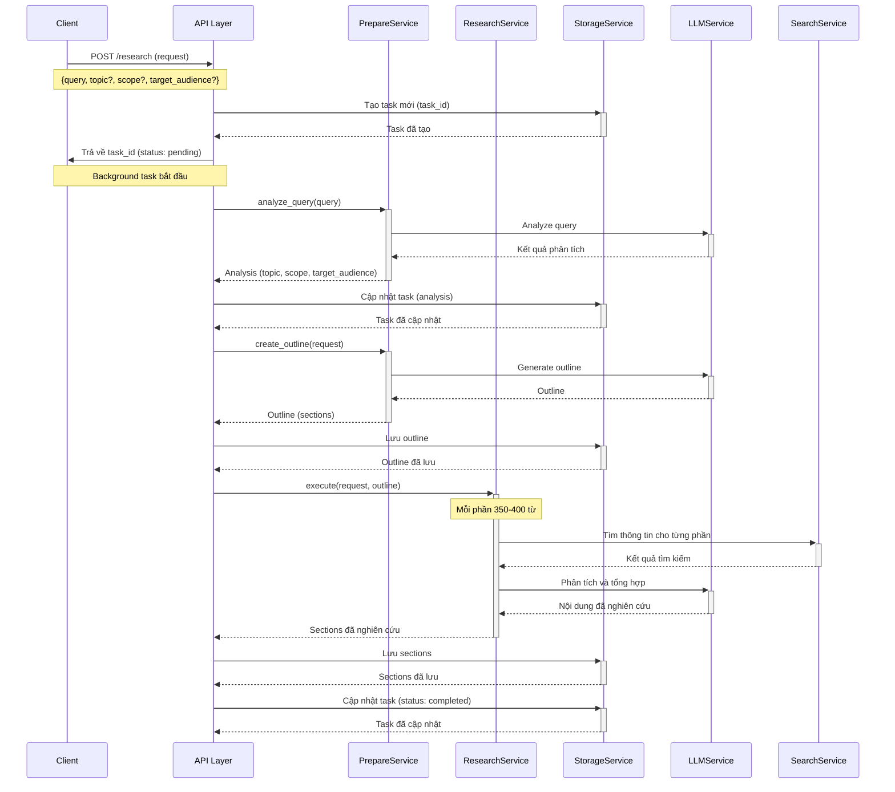
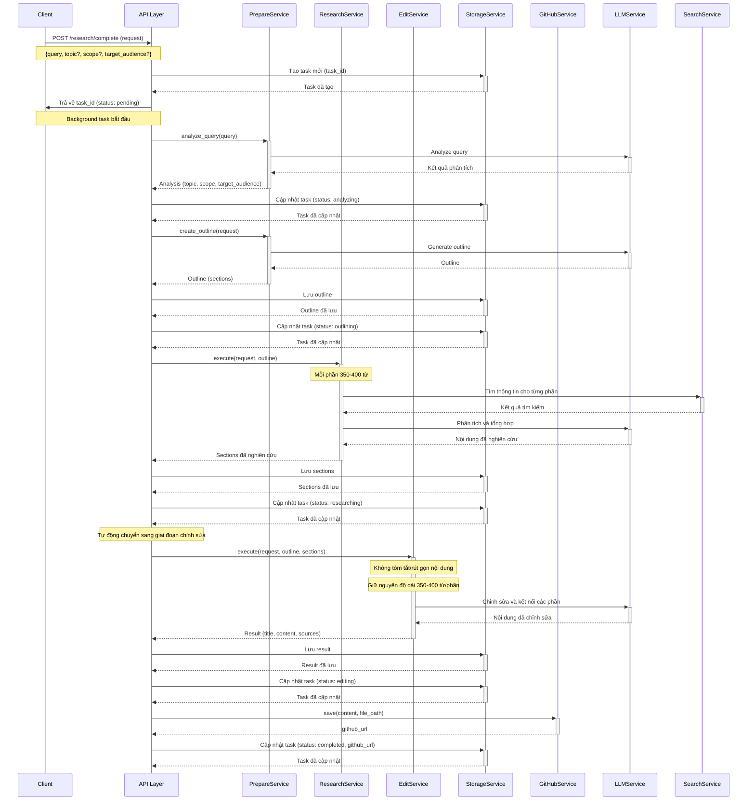
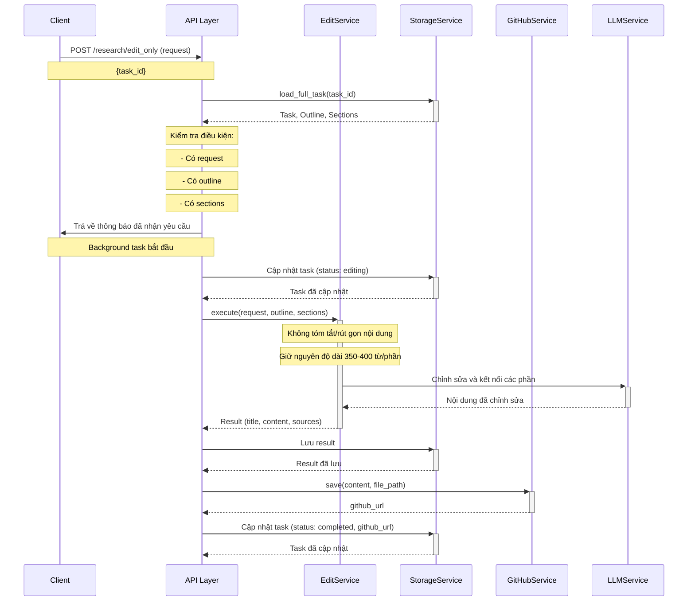
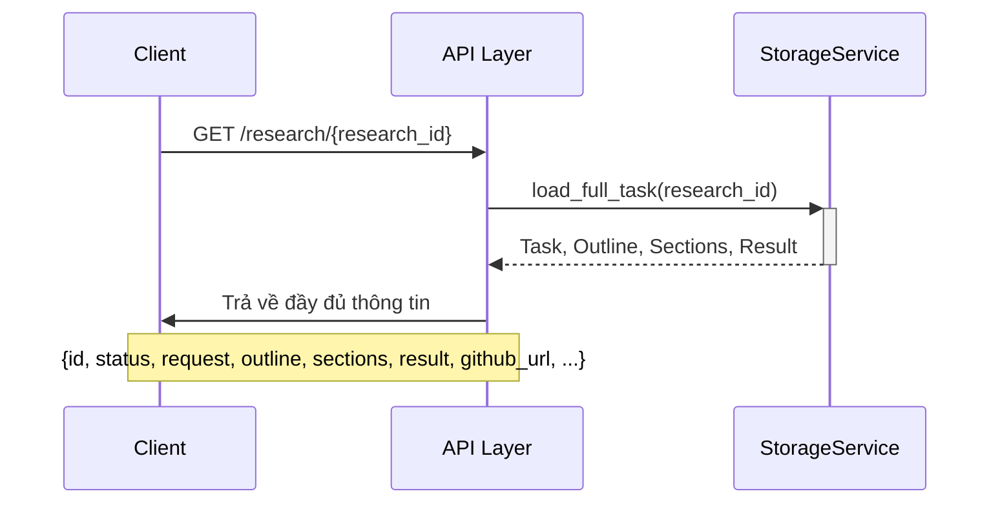
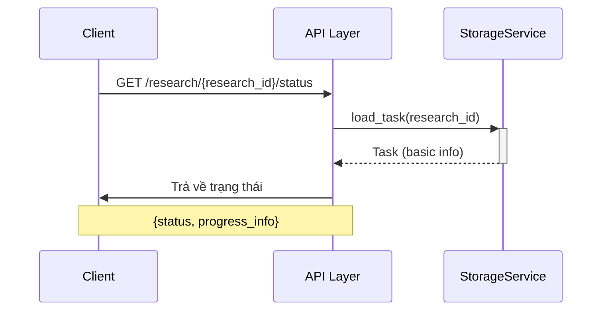
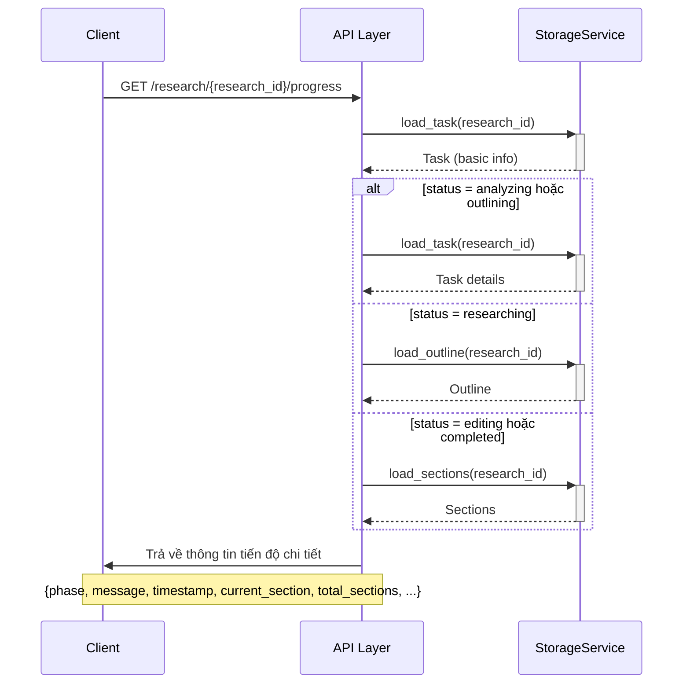
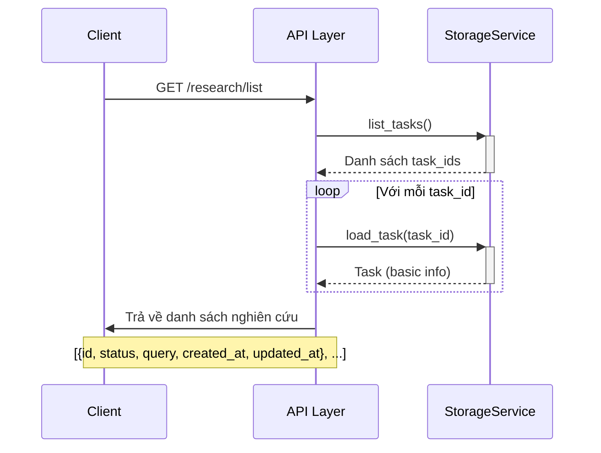
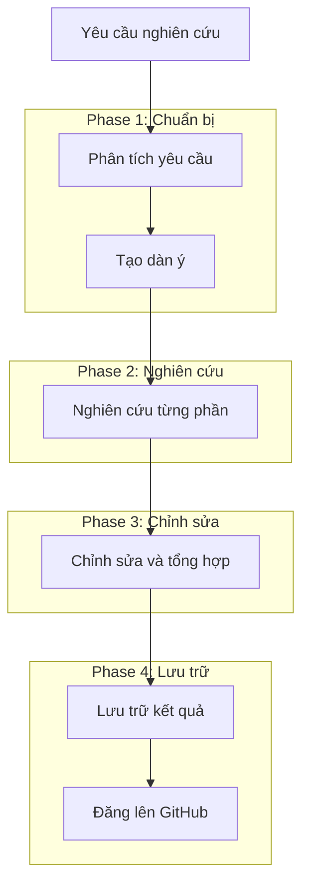

# Sequence Diagrams cho API Endpoints

## 1. POST `/research` - Tạo yêu cầu nghiên cứu mới

## 2. POST `/research/complete` - Tạo yêu cầu nghiên cứu hoàn chỉnh (tự động)

## 3. POST `/research/edit_only` - Chỉnh sửa nội dung nghiên cứu sẵn có

## 4. GET `/research/{research_id}` - Lấy thông tin và kết quả nghiên cứu

## 5. GET `/research/{research_id}/status` - Lấy trạng thái hiện tại của yêu cầu nghiên cứu

## 6. GET `/research/{research_id}/progress` - Lấy thông tin tiến độ chi tiết

## 7. GET `/research/list` - Lấy danh sách các yêu cầu nghiên cứu

## Tóm tắt quy trình nghiên cứu hoàn chỉnh

